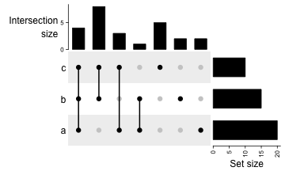
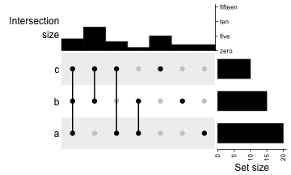
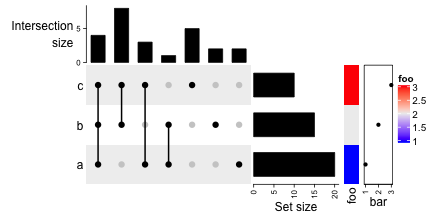
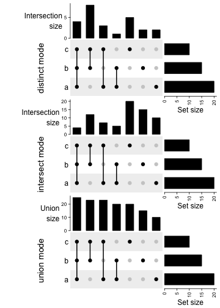
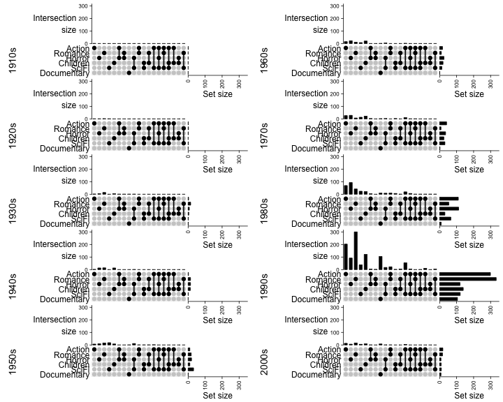

# Heatmap Annotations

Heatmap annotations are important components of a heatmap that it shows
additional information that associates with rows or columns in the heatmap.
**ComplexHeatmap** package provides very flexible supports for setting
annotations or defining new annotation graphics. The annotations can be put on
the four sides of the heatmap, by `top_annotation`, `bottom_annotation`,
`left_annotation` and `right_annotation` arguments.

The value for the four arguments should be in the `HeatmapAnnotation` class and
should be constructed by `HeatmapAnnotation()` or by `rowAnnotation()` if it is
row annotation. (`rowAnnotation()` is just a helper function which is identical
to `HeatmapAnnotation(..., which = "row")`) A simple usage of annotations is as
follows.


```r
set.seed(123)
mat = matrix(rnorm(100), 10)
column_ha = HeatmapAnnotation(foo1 = runif(10), bar1 = anno_barplot(runif(10)))
row_ha = rowAnnotation(foo2 = runif(10), bar2 = anno_barplot(runif(10)))
Heatmap(mat, name = "mat", top_annotation = column_ha, right_annotation = row_ha)
```


Or assign as bottom annotation and left annotation.


```r
Heatmap(mat, name = "mat", bottom_annotation = column_ha, left_annotation = row_ha)
```


In above examples, for `column_ha` and `row_ha`, both have two annotations where
`foo1` and `foo2` are numeric vectors and `bar1` and `bar2` are barplots. The
vector-like annotation is called _"simple annotation"_ here and the barplot
annotation is called _"complex annotation"_. You can already see the annotations
are defined as name-value pairs. Of course, the names used as arguments in
`HeatmapAnnotation()` cannot be used as annotation names.

`HeatmapAnnotation()` returns a `HeatmapAnnotation` class object. The object is
usually composed of several annotations. If following sections of this chapter,
we first introduce settings for individal annotation, and later we show how to
put them toghether.

You can see the information of the `column_ha` and `row_ha` objects:


```r
column_ha
```

```
## A HeatmapAnnotation object with 2 annotations
##   name: heatmap_annotation_4 
##   position: column 
##   items: 10 
##   width: 1npc 
##   height: 15mm 
##   this object is  subsetable
##   5.52777777777778mm extension on the left 
##   9.81944444444445mm extension on the right 
## 
##  name    annotation_type color_mapping height
##  foo1  continuous vector        random    5mm
##  bar1 AnnotationFunction                 10mm
```

```r
row_ha
```

```
## A HeatmapAnnotation object with 2 annotations
##   name: heatmap_annotation_5 
##   position: row 
##   items: 10 
##   width: 15mm 
##   height: 1npc 
##   this object is  subsetable
##   9.70277777777778mm extension on the bottom 
## 
##  name    annotation_type color_mapping width
##  foo2  continuous vector        random   5mm
##  bar2 AnnotationFunction                10mm
```

In following examples in this chapter, we will only show the plot for the
annotations but with no heatmap, unless it is necessary. The `HeatmapAnnotation`
object which we always name as `ha` can just be assigned to `top_annotation`,
..., or as an independent component to be added to the heatmap list (which we
will introduce in the next chapter).

Settings are basically the same for column annotations and row annotations. If
there is nothing specicial, we only show the column annotation as examples. If
you want to try row annotation, just add `which = "row"` to
`HeatmapAnnotation()` or directly change to `rowAnnotation()`. 

## Simple annotation

A so-called _"simple annotation"_ is the most used style of annotations which is
heatmap-like or grid-like graphics where colors are used to map to the anntation
values. To generate a simple annotation, you just simply put the annotation
vector in `HeatmapAnnotation()` with a specific name.


```r
ha = HeatmapAnnotation(foo = 1:10)
```


Or a discrete annotation:


```r
ha = HeatmapAnnotation(bar = sample(letters[1:3], 10, replace = TRUE))
```


If colors are not specified, colors are randomly generated. To set the colors
for annotations, `col` needs to be set as a named list. For continuous values,
the color mapping should be a color mapping function generated by
`circlize::colorRamp2()`.


```r
col_fun = colorRamp2(c(0, 5, 10), c("blue", "white", "red"))
ha = HeatmapAnnotation(foo = 1:10, col = list(foo = col_fun))
```


And for discrete annotations, the color should be a named vector where names
correspond to the levels in the annotation.


```r
ha = HeatmapAnnotation(bar = sample(letters[1:3], 10, replace = TRUE),
    col = list(bar = c("a" = "red", "b" = "green", "c" = "blue")))
```



And you can see how `col` is set when `foo` and `bar` are all put into a single
`HeatmapAnnotation()`.


```r
ha = HeatmapAnnotation(
    foo = 1:10, 
    bar = sample(letters[1:3], 10, replace = TRUE),
    col = list(foo = col_fun,
               bar = c("a" = "red", "b" = "green", "c" = "blue")
    )
)
```


The color for `NA` value is controlled by `na_col` argument.


```r
ha = HeatmapAnnotation(
    foo = c(1:4, NA, 6:10), 
    bar = c(NA, sample(letters[1:3], 9, replace = TRUE)),
    col = list(foo = col_fun,
               bar = c("a" = "red", "b" = "green", "c" = "blue")
    ),
    na_col = "black"
)
```


The simple annotation can also be a matrix (numeric or character) that all the
columns in the matrix share a same color mapping schema. **Note columns in the
matrix correspond to the rows in the column annotation.** Also the column names
of the matrix are used as the annotation names.


```r
ha = HeatmapAnnotation(foo = cbind(a = runif(10), b = runif(10)))
```


As simple annotations can be in different modes (e.g. numeric, or character),
they can be combined as a data frame and send to `df` argument. Imaging in your
project, you might already have an annotation table, you can directly set it by
`df`.


```r
anno_df = data.frame(foo = 1:10,
    bar = sample(letters[1:3], 10, replace = TRUE))
ha = HeatmapAnnotation(df = anno_df,
    col = list(foo = col_fun,
               bar = c("a" = "red", "b" = "green", "c" = "blue")
    )
)
```


Single annotations and data frame can be mixed. In following example, colors for
`foo2` is not specified, random colors
will be used.


```r
ha = HeatmapAnnotation(df = anno_df,
    foo2 = rnorm(10),
    col = list(foo = col_fun,
               bar = c("a" = "red", "b" = "green", "c" = "blue")
    )
)
```



## Simple annotation as annotation function

`HeatmapAnnotation()` supports _"complex annotation"_ by setting the annotation
as a function. The annotation function defines how to draw the graphics at a
certain position corresponding to the column or row in the heatmap. There are
quite a lot of annotation functions predefined in **ComplexHeatmap** package.
and in the end of this chapter, we will introduce how to construct your own
annotation function by the `AnnotationFunction` class.

For all the annotation functions in forms of `anno_*()`, if it is specified in
`HeatmapAnnotation()` or `rowAnnotation()`, you don't need to do anything
explicitly on `anno_*()` to tell it should be drawn on rows or columns.
`anno_*()` automatically detects whether it is a row annotation environment or a
column annotation environment.

The simple annotation shown in previous section is internally constructed by
`anno_simple()` annotation function. However, directly use `anno_simple()` will
not automatically generate legends for the final plot. However, it can provide
more flexibility for more annotation graphics (note later chapter we will show, although
the annotation functions cannot automatically generate the legend, the legend
can be controlled and added to the final plot manually).

For an example in previous section:


```r
# code only for demonstration
ha = HeatmapAnnotation(foo = 1:10)
```

is actually identical to:


```r
# code only for demonstration
ha = HeatmapAnnotation(foo = anno_simple(1:10))
```

`anno_simple()` makes heatmap-like annotations. Basically if users only make
heatmap-like annotations, they do not need to directly use `anno_simple()`, but
the function allows to add more symbols on the annotation grids.

`anno_simple()` allows to add "points" or single letter symbols on top of the
annotation grids. `pch`, `pt_gp` and `pt_size` control the settings of the points. The
value of `pch` can be a vector with possible `NA` values.


```r
ha = HeatmapAnnotation(foo = anno_simple(1:10, pch = 1, 
    pt_gp = gpar(col = "red"), pt_size = unit(seq(1, 10), "mm")))
```


Set `pch` as a vector:


```r
ha = HeatmapAnnotation(foo = anno_simple(1:10, pch = 1:10))
```



Set `pch` as a vector of letters:


```r
ha = HeatmapAnnotation(foo = anno_simple(1:10, 
    pch = sample(letters[1:3], 10, replace = TRUE)))
```



Set `pch` as a vector with `NA` values:


```r
ha = HeatmapAnnotation(foo = anno_simple(1:10, pch = c(1:4, NA, 6:8, NA, 10, 11)))
```


`pch` also works if the value for `anno_simple()` is a matrix; The length of `pch`
can be same as the number of matrix rows or columns or even a matrix.

Lenght of `pch` corresponds to matrix columns:


```r
ha = HeatmapAnnotation(foo = anno_simple(cbind(1:10, 10:1), pch = 1:2))
```


Lenght of `pch` corresponds to matrix rows:


```r
ha = HeatmapAnnotation(foo = anno_simple(cbind(1:10, 10:1), pch = 1:10))
```



`pch` is a matrix:


```r
pch = matrix(1:20, nc = 2)
pch[sample(length(pch), 10)] = NA
ha = HeatmapAnnotation(foo = anno_simple(cbind(1:10, 10:1), pch = pch))
```


The height of the annotation can be controled by `height` argument (or `width`
if it is a row annotation) inside `anno_simple()`. By default it is `5mm` for
one row annotation and `5mm * k` for a matrix with `k` columns.

The `HeatmapAnnotation()` also has `width` and `height` arguments, but if you only
set the width or height of a single annotation, you need to set it in the annotation
function. The `width` and `height` in `HeatmapAnnotation()` are only used to adjust 
for all single annotations that `HeatmapAnnotation()` contains. We will discuss
it in the end of this chapter.

## Empty annotation

`anno_empty()` is a place holder that nothing is drawn. Later graphics can be
added by `decorate_annotation()`.


```r
ha = HeatmapAnnotation(foo = anno_empty(border = TRUE))
```


The default height for column empty annotation is `1cm`.

## Image annotation

Images can be added as annotations. `anno_image()` supports image formats in
`png`, `svg`, `pdf`, `eps`, `jpeg/jpg`, `tiff`. `png`, `jpeg/jpg` and `tiff`
images are imported by `png::readPNG()`, `jpeg::readJPEG()` and `tiff::readTIFF()`,
and drawn by `grid::grid.raster()`. `svg` images are firstly reformatted by
`rsvg::rsvg_svg()` and then imported by `grImport2::readPicture()` and drawn by
`grImport2::grid.picture()`. `pdf` and `eps` images are imported by
`grImport::PostScriptTrace()` and `grImport::readPicture()`, later drawn by
`grImport::grid.picture()`.

The free icons for following examples are from https://github.com/Keyamoon/IcoMoon-Free.
A vector of image pathes are set as the first argument of `anno_image()`.


```r
image_png = sample(dir("~/Downloads/IcoMoon-Free-master/PNG/64px", full.names = TRUE), 10)
image_svg = sample(dir("~/Downloads/IcoMoon-Free-master/SVG/", full.names = TRUE), 10)
image_eps = sample(dir("~/Downloads/IcoMoon-Free-master/EPS/", full.names = TRUE), 10)
image_pdf = sample(dir("~/Downloads/IcoMoon-Free-master/PDF/", full.names = TRUE), 10)

# we only draw the image annotation for PNG images, while the others are the same
ha = HeatmapAnnotation(foo = anno_image(image_png))
```


Different image formats can be mixed in the input vector.


```r
# code is only for demonstration
ha = HeatmapAnnotation(foo = anno_image(c(image_png[1:3], image_svg[1:3], 
    image_eps[1:3], image_pdf[1:3])))
```

Border and background colors can be set by `gp`.


```r
ha = HeatmapAnnotation(foo = anno_image(image_png, 
    gp = gpar(fill = 1:10, col = "black")))
```


`border` controls the border of the whole annotation.


```r
# code only for deonstration
ha = HeatmapAnnotation(foo = anno_image(image_png, border = "red"))
```

Padding or space around the images is set by `space`.


```r
ha = HeatmapAnnotation(foo = anno_image(image_png, space = unit(3, "mm")))
```


If only some of the images need to be drawn, the other elements in the `image`
vector can be set to `''` or `NA`.


```r
image_png[1:2] = ""
ha = HeatmapAnnotation(foo = anno_image(image_png))
```


The default height for column image annotation is `1cm`.

## Points annotation

Points annotation shows distribution of a list of data points. The data points
object `x` can be a single vector or a matrix. If it is a matrix, the graphic
settings such as `pch`, `size` and `gp` can correpspond to matrix columns.


```r
ha = HeatmapAnnotation(foo = anno_points(runif(10)))
```


```r
ha = HeatmapAnnotation(foo = anno_points(matrix(runif(20), nc = 2), 
    pch = 1:2, gp = gpar(col = 2:3)))
```


`ylim` controls the range on "y-axis" or the "data axis" (if it is a row
annotation, the data axis is horizontal), `extend` controls the extended space
on the data axis direction. `axis` controls whether to show the axis and
`axis_param` controls the settings for axis. The default settings for axis are:


```r
default_axis_param("column")
```

```
## $at
## NULL
## 
## $labels
## NULL
## 
## $labels_rot
## [1] 0
## 
## $gp
## $fontsize
## [1] 8
## 
## 
## $side
## [1] "left"
## 
## $facing
## [1] "outside"
```
 
And you can overwrite some of them:


```r
ha = HeatmapAnnotation(foo = anno_points(runif(10), 
    axis_param = list(
        side = "right",
        at = c(0, 0.5, 1), 
        labels = c("zero", "half", "one")
    ))
)
```


The configuration of axis is same for other annotation functions which have axes.

The default height of the column points annotation is `1cm`.

## Lines annotation

`anno_lines()` connects the data points by a list of segments. Similar as `anno_points()`,
the data variable can be a numeric vector:


```r
ha = HeatmapAnnotation(foo = anno_lines(runif(10)))
```


Or a matrix:


```r
ha = HeatmapAnnotation(foo = anno_lines(cbind(c(1:5, 1:5), c(5:1, 5:1)), gp = gpar(col = 2:3),
  add_points = TRUE, pt_gp = gpar(col = 5:6), pch = c(1, 16)))
```


Smoothed lines (by `loess()`) can be added instead of the original lines by
setting `smooth = TRUE`, but it should be used with caution because the order of
columns in the heatmap is used as "x-value" for the fitting and the order will
change after the clustering of the heatmap.

Smoothing also works in the input data variable is a matrix that the smoothing
is performed for each column separately.


```r
ha = HeatmapAnnotation(foo = anno_lines(runif(10), smooth = TRUE, add_points = TRUE))
```


The default height for column lines annotation is `1cm`.

## Barplot annotation

The data points can be represented as barplots. Some of the arguments such as
`ylim`, `axis`, `axis_param` are same as `anno_points()` that users can refer to the documentation
of `anno_barplot()`.


```r
ha = HeatmapAnnotation(foo = anno_barplot(1:10))
```


The width of bars is controlled by `bar_width`. It is a relative value to the 
width of the cell in the heatmap.


```r
ha = HeatmapAnnotation(foo = anno_barplot(1:10, bar_width = 1))
```


Graphic parameters are controlled by `gp`.


```r
ha = HeatmapAnnotation(foo = anno_barplot(1:10, gp = gpar(fill = 1:10)))
```


You choose the baseline of bars by `baseline`.


```r
ha = HeatmapAnnotation(foo = anno_barplot(seq(-5, 5), baseline = "min"))
```


If the input value is a matrix, it will be represented as stacked barplots.


```r
ha = HeatmapAnnotation(foo = anno_barplot(matrix(nc = 2, c(1:10, 10:1))))
```


And length of parameters in `gp` can be the number of the columns in the matrix:


```r
ha = HeatmapAnnotation(foo = anno_barplot(cbind(1:10, 10:1), 
    gp = gpar(fill = 2:3, col = 2:3)))
```


Following example shows a barplot annotation which visualizes a proportion
matrix (for which row sums are 1).


```r
m = matrix(runif(4*10), nc = 4)
m = t(apply(m, 1, function(x) x/sum(x)))
ha = HeatmapAnnotation(foo = anno_barplot(m, gp = gpar(fill = 2:5), 
    bar_width = 1, height = unit(6, "cm")))
```


The default height for column barplot annotation is `1cm`.

## Boxplot annotation

Boxplot annotation as well as the annotation functions which are introduced
later are more suitable for small matrice. You don't want to put boxplots as
column annotation for a matrix with 100 columns.

For `anno_boxplot()`, the input data variable should be a matrix or a list. If
`x` is a matrix and if it is a column annotation, statistics for boxplots are
calculated by columns, and if it is a row annotation, the calculation is done by rows.


```r
set.seed(12345)
m = matrix(rnorm(100), 10)
ha = HeatmapAnnotation(foo = anno_boxplot(m, height = unit(4, "cm")))
```


Graphic parameters are controlled by `gp`.


```r
ha = HeatmapAnnotation(foo = anno_boxplot(m, height = unit(4, "cm"), 
    gp = gpar(fill = 1:10)))
```


Width of the boxes are controlled by `box_width`. `outline` controls whether to
show outlier points.


```r
ha = HeatmapAnnotation(foo = anno_boxplot(m, height = unit(4, "cm"), 
    box_width = 0.9, outline = FALSE))
```


The default height of column boxplot annotation is `2cm`.

## histogram annotation

Annotations as histograms are more suitable to put as row annotations. The 
histogram annotation shows the distribution of each row by histograms. The setting
for the data variable is the same as `anno_boxplot()` which can be a matrix or a list.


```r
m = matrix(rnorm(1000), nc = 100)
ha = rowAnnotation(foo = anno_histogram(m)) # apply `m` on rows
```


Number of breaks for histograms is controlled by `n_breaks`.


```r
ha = rowAnnotation(foo = anno_histogram(m, n_breaks = 20))
```


Colors are controlled by `gp`.


```r
ha = rowAnnotation(foo = anno_histogram(m, gp = gpar(fill = 1:10)))
```


The default for column histogram annotation is `4cm`.

## Density annotation

Similar as histogram annotations, `anno_density()` shows the distribution
as a fitted curve.


```r
ha = rowAnnotation(foo = anno_density(m))
```


The height of the density lines can be controlled to make the distribution
look like a "joyplot".


```r
ha = rowAnnotation(foo = anno_density(m, joyplot_scale = 2, 
    gp = gpar(fill = "#CCCCCC80")))
```


Or visualize the distribution as violin plot.


```r
ha = rowAnnotation(foo = anno_density(m, type = "violin", 
    gp = gpar(fill = 1:10)))
```


When there are too many rows, the space for normal density peaks might be too small.
In this case, we can visualize the distribution by heatmaps. 


```r
ha = rowAnnotation(foo = anno_density(m, type = "heatmap", width = unit(6, "cm")))
```


THe color schema for heatmap distribution is controlled by `heatmap_colors`.


```r
ha = rowAnnotation(foo = anno_density(m, type = "heatmap", width = unit(6, "cm"), 
    heatmap_colors = c("white", "orange")))
```


In **ComplexHeatmap** package, there is a `densityHeatmap()` function which visualizes
distribution as a heatmap (not an annotation).

## Joyplot annotation

`anno_joyplot()` is specifical for so-called joyplot (http://blog.revolutionanalytics.com/2017/07/joyplots.html).


```r
m = matrix(rnorm(1000), nc = 10)
lt = apply(m, 2, function(x) data.frame(density(x)[c("x", "y")]))
ha = rowAnnotation(foo = anno_joyplot(lt, width = unit(4, "cm"), 
    gp = gpar(fill = 1:10), transparency = 0.75))
```


Or only show the lines.


```r
m = matrix(rnorm(5000), nc = 50)
lt = apply(m, 2, function(x) data.frame(density(x)[c("x", "y")]))
ha = rowAnnotation(foo = anno_joyplot(lt, width = unit(4, "cm"), gp = gpar(fill = NA), scale = 4))
```


## Horizon chart annotation

[Horizon chart](https://flowingdata.com/2015/07/02/changing-price-of-food-items-and-horizon-graphs/)
as annotation can only be added as row annotation. The value for `anno_horizon()` should be a list
or a matrix where matrix columns correspond to rows in the annotation.

The default style of horizon chart annotation is:


```r
lt = lapply(1:20, function(x) cumprod(1 + runif(1000, -x/100, x/100)) - 1)
ha = rowAnnotation(foo = anno_horizon(lt))
```


Colors for positive values and negative values are controlled by `pos_fill` and
`neg_fill` in `gar()`.


```r
ha = rowAnnotation(foo = anno_horizon(lt, 
    gp = gpar(pos_fill = "orange", neg_fill = "darkgreen")))
```


`pos_fill` and `neg_fill` can be assigned as a vector.


```r
ha = rowAnnotation(foo = anno_horizon(lt, 
    gp = gpar(pos_fill = rep(c("orange", "red"), each = 10),
              neg_fill = rep(c("darkgreen", "blue"), each = 10))))
```


Whether the peaks for negative values start from the bottom or the top?


```r
ha = rowAnnotation(foo = anno_horizon(lt, negative_from_top = TRUE))
```


The space between every two neighbouring charts.


```r
ha = rowAnnotation(foo = anno_horizon(lt, gap = unit(1, "mm")))
```


## Text annotation

Text can be used as annotations by `anno_text()`. Graphic parameters are controlled
by `gp`.


```r
ha = rowAnnotation(foo = anno_text(month.name, gp = gpar(fontsize = 1:12+4)))
```


Locationsn are controlled by `location` and `just`. Rotation is controlled by `rot`.


```r
ha = rowAnnotation(foo = anno_text(month.name, location = 1, rot = 45, 
    just = "right", gp = gpar(fontsize = 1:12+4)))
```


## Mark annotation

Sometimes there are many rows or columns in the heatmap and we want to mark some of them.
`anno_mark()` is used to mark subset of rows or columns and connect labels with lines.


```r
m = matrix(rnorm(1000), nrow = 100)
ha = rowAnnotation(foo = anno_mark(at = c(1:4, 20, 60, 97:100), labels = month.name[1:10]))
Heatmap(m, cluster_rows = FALSE, right_annotation = ha)
```


## Multiple annotations

As mentioned before, to put multiple annotations in `HeatmapAnnotation()`, they
just need to be specified as name-value pairs. In `HeatmapAnnotation()`, there are
some arguments which controls multiple annotations. For these arguments, they
are specified as a vector which has same length as number of the annotations, or
a named vector with subset of the annotations.

The simple annotations which are specified as vectors, matrices and data frames
will automatically have legends on the heatmap. `show_legend` controls whether draw
the legend for them. Note here if `show_legend` is a vector, **the length of `show_legend`
should be the same as the simple annotations while not the number of all annotations.**

`gp` controls graphic parameters (except `fill`) for the simple annotatios, such
as the border of annotation grids.

`border` controls the border of every single annotations. `show_annotation_name`
controls whether show annotation names. As mentioned, the value can be a single
value, a vector or a named vector. `annotation_name_gp`,
`annotation_name_offset`, `annotation_name_side` and `annotation_name_rot`
controls the style and positions of the annotation names.

`gap` controls the space between every two neighbouring annotations. The value
can be a single unit or a vector of units.


```r
ha = HeatmapAnnotation(foo = 1:10, 
    bar = cbind(1:10, 10:1),
    pt = anno_points(1:10),
    gap = unit(2, "mm"))
```


```r
ha = HeatmapAnnotation(foo = 1:10, 
    bar = cbind(1:10, 10:1),
    pt = anno_points(1:10),
    gap = unit(c(2, 10), "mm"))
```


`height`, `width`, `annotation_height` and `annotation_width` control the height
or width of the heatmap annotations. Normally you don't need to set it because
all the single annotations have fixed height/width and the final height/width
for the whole heatmap annotation is the sum of them plus the sum of gaps. ...
 

## Implement new annotation function


A normal R function defines how to draw the annotation graphics. As expected, the main part of the `AnnotationFunction`
class is this function. The function defines how to draw at specific positions which correspond to rows or columns
in the heatmap. The function should have three arguments: `index`, `k` and `n` (the names of the arguments can
be arbitory) where `k` and `n` are optional. `index` corresponds to the indices of rows or columns of the heatmap.
The value of `index` is not necessarily to be the whole row indices or column indices. It can also be a subset of
the indices if the annotation is split into slices according to the split of the heatmap. The value in `index` is
always sorted according to the reordering of heatmap rows or columns (e.g. by clustering). So, `index` actually contains
a list of row or column indices for the current slice after row or column reordering. This type of design makes sure
the annotation graphics are drawn at the correct positions and can be correctly corresponded to the heatmap rows or columns.

As mentioned, annotation can be split into slices. `k` corresponds to the current slice and `n` corresponds to
the total number of slices. The information of `k` and `n` sometimes can be useful, for example, we want to add axis
in the annotation, and if it is a column annotation and axis is drawn on the very right of the annotation area, the axis
is only drawn when `k == n`.

Since the function only allows `index`, `k` and `n`, the function sometimes uses several external variables which can
not be defined inside the function, e.g. the data points for the annotation. These variables should be imported
into the AnnotationFunction class so that the function can correctly find these variables. 

One important feature for AnnotationFunction class is it can be subsetable. To allow subsetting of the object,
users need to define the rule for the imported variables if there is any. The rules are simple function which
accpets the variable and indices, and returns the subset of the variable. The subset rule functions implemented
in this package are `subset_gp`, `subset_matrix_by_row` and `subset_vector`. These three functions are enough for
most of the cases.

In following, we defined three AnnotationFunction objects: 

1. It needs external variable and support subsetting

  x = 1:10
  anno1 = AnnotationFunction(
      fun = function(index) {
          n = length(index)
          pushViewport(viewport())
          grid.points(1:n, x[index])
          popViewport()
      },
      var_imported = list(x = x),
      n = 10,
      subset_rule = list(x = subset_vector),
      subsetable = TRUE
  )

2. The data variable is defined inside the function and no need to import other variables.

  anno2 = AnnotationFunction(
      fun = function(index) {
          x = 1:10
          n = length(index)
          pushViewport(viewport())
          grid.points(1:n, x[index])
          popViewport()
      },
      n = 10,
      subsetable = TRUE
  )

3. The most compact way to only specify the function to the constructor.

  anno3 = AnnotationFunction(
      fun = function(index) {
          x = 1:10
          n = length(index)
          pushViewport(viewport())
          grid.points(1:n, x[index])
          popViewport()
      }
  )

Finally, you need to push a viewport for graphics and finally pop the viewport.
