# Making A List of Heatmaps

The main feature of **ComplexHeatmap** package is it supports to concatenate a list of 
heatmaps/annotations horizontally or vertically so that it makes it possible to visualize
the associations from various sources of information. In this chapter, we mainly introduce
the horizontal concatenation because this is the major case we will use in the analysis. In
the end we show some examples of vertical concatenation. The concept behind basically is similar.

For the horizontal concatenation, the number of rows for all heatmaps/annotations should be the same.
In following we first introduce the concatenation of heatmaps and later we will show how to concatenate
heatmaps with annotations.

In following example, there are three matrices where the third heatmap is a vector and it will
be transformed as a one-column matrix. The one-column heatmap is sometimes useful when you
concatenate a list of heatmaps that it can show e.g. annotations for each row or some scores
of each row. e.g. if rows are genes, the the whether genes are protein coding gene can be 
represented ..., or p-values or foldchange from differnetial...

To concatenate heatmaps, simply use `+` operator.


```r
set.seed(123)
mat1 = matrix(rnorm(80, 2), 8, 10)
mat1 = rbind(mat1, matrix(rnorm(40, -2), 4, 10))
rownames(mat1) = paste0("R", 1:12)
colnames(mat1) = paste0("C", 1:10)

mat2 = matrix(runif(60, max = 3, min = 1), 6, 10)
mat2 = rbind(mat2, matrix(runif(60, max = 2, min = 0), 6, 10))
rownames(mat2) = paste0("R", 1:12)
colnames(mat2) = paste0("C", 1:10)

le = sample(letters[1:3], 12, replace = TRUE)
names(le) = paste0("R", 1:12)

ind = sample(12, 12)
mat1 = mat1[ind, ]
mat2 = mat2[ind, ]
le = le[ind]

ht1 = Heatmap(mat1, name = "rnorm")
ht2 = Heatmap(mat2, name = "runif")
ht3 = Heatmap(le, name = "letters")

ht1 + ht2 + ht3
```


Under default mode, dendrograms from the second heatmap will be removed and
row orders will be same as the first one. also row names which are put on the right
side of the heatmap for hte first two heatmaps are removed as well.

The returned value of addition of two heatmaps is a `HeatmapList` object.
Directly calling `ht_list` object will call `draw()` method with default
settings. With explicitly calling `draw()` method, you can have more controls
e.g. on the legend and titles.


```r
ht_list = ht1 + ht2 + ht3
class(ht_list)
```

```
## [1] "HeatmapList"
## attr(,"package")
## [1] ".GlobalEnv"
```

You can append any number of heatmaps to the heatmap list. Also you can append a heatmap list to a heatmap list.


```r
ht1 + ht_list
ht_list + ht1
ht_list + ht_list
```

`NULL` can be added to the heatmap list. It would be convinient when users want to construct a heatmap list through a `for` loop.


```r
ht_list = NULL  ## Heatmap(...) + NULL gives you a HeatmapList object
for(s in sth) {
    ht_list = ht_list + Heatmap(...)
}
```

## Titles

A heatmap list also has titles which are independent to the heatmap titles.


```r
col_rnorm = colorRamp2(c(-3, 0, 3), c("green", "white", "red"))
col_runif = colorRamp2(c(0, 3), c("white", "orange"))
col_letters = c("a" = "pink", "b" = "purple", "c" = "blue")
ht1 = Heatmap(mat1, name = "rnorm", col = col_rnorm,
    row_title = "Heatmap 1", column_title = "Heatmap 1")
ht2 = Heatmap(mat2, name = "runif", col = col_runif,
    row_title = "Heatmap 2", column_title = "Heatmap 2")
ht3 = Heatmap(le, name = "letters", col = col_letters)
ht_list = ht1 + ht2 + ht3

draw(ht_list, row_title = "Three heatmaps, row title", row_title_gp = gpar(col = "red"),
    column_title = "Three heatmaps, column title", column_title_gp = gpar(fontsize = 16))
```


## Size of heatmaps

The width for some (not all) heatmaps can be set to a fixed width.


```r
ht2 = Heatmap(mat2, name = "runif", col = col_runif, width = unit(4, "cm"))
ht3 = Heatmap(le, name = "letters", col = col_letters, width = unit(5, "mm"))
ht1 + ht2 + ht3
```


or the width can be set as relative values. Please not in this case, `width` for all heatmaps
should be set (relative width and fixed width can be mixed).


```r
ht1 = Heatmap(mat1, name = "rnorm", col = col_rnorm, width = unit(4, "cm"))
ht2 = Heatmap(mat2, name = "runif", col = col_runif, width = unit(6, "cm"))
ht3 = Heatmap(le, name = "letters", col = col_letters, width = unit(1, "cm"))
ht1 + ht2 + ht3
```


```
## Since all heatmaps/annotations have absolute units, the total width of the plot is 154mm
```


```r
ht1 = Heatmap(mat1, name = "rnorm", col = col_rnorm,
    show_row_names = FALSE, width = 6)
ht2 = Heatmap(mat2, name = "runif", col = col_runif,
    show_row_names = FALSE, width = 4)
ht3 = Heatmap(le, name = "letters", col = col_letters, width = 1)
ht1 + ht2 + ht3
```


## Gap between heatmaps


```r
ht1 = Heatmap(mat1, name = "rnorm", col = col_rnorm)
ht2 = Heatmap(mat2, name = "runif", col = col_runif)
ht3 = Heatmap(le, name = "letters", col = col_letters)
draw(ht_list, ht_gap = unit(1, "cm"))
```


```r
draw(ht_list, ht_gap = unit(c(3, 10), "mm"))
```


## Auto adjustment to the main heatmap

There are some automatic adjustment if more than one heatmaps are plotted. There should be a main
heatmap which by default is the first one. Some settings for the remaining heatmaps will be modified
to the settings in the main heatmap. The adjustment are:

- row clusters are removed.
- row titles are removed.
- if the main heatmap is split by rows, all remaining heatmaps will also be split by same levels as
  the main one.

The main heatmap can be specified by `main_heatmap` argument. The value can be a numeric index or
the name of the heatmap (of course, you need to set the heatmap name when you create the `Heatmap`
object).


```r
ht1 = Heatmap(mat1, name = "rnorm", col = col_rnorm, km = 2)
ht2 = Heatmap(mat2, name = "runif", col = col_runif)
ht3 = Heatmap(le, name = "letters", col = col_letters)
```


```r
ht2 + ht1 + ht3
```


here although `ht1` is the second heatmap, we specify `ht1` to be
the main heatmap by explicitely setting `main_heatmap` argument


```r
ht_list = ht2 + ht1 + ht3
draw(ht_list, main_heatmap = "rnorm")
```


```r
ht_list = ht2 + ht1 + ht3
draw(ht_list, main_heatmap = "rnorm", row_dend_side = "right", row_sub_title_side = "left")
```


If there is no row clustering in the main heatmap, all other heatmaps have no row clustering neither.


```r
ht1 = Heatmap(mat1, name = "rnorm", col = col_rnorm, cluster_rows = FALSE)
ht2 = Heatmap(mat2, name = "runif", col = col_runif)
ht3 = Heatmap(le, name = "letters", col = col_letters)
ht1 + ht2 + ht3
```


## control row ... in draw() function


Since the main heamtap controls the row order of all heatmaps, the parameters which co...


- cluster_rows
- clustering_distance_rows
- clustering_method_rows 
- row_dend_width
- show_row_dend
- row_dend_reorder
- row_dend_gp
- row_order 

And for splitting rows 

- row_gap
- row_km
- row_split


```r
ht1 = Heatmap(mat1, name = "rnorm", col = col_rnorm, row_km = 2)
ht2 = Heatmap(mat2, name = "runif", col = col_runif)
ht3 = Heatmap(le, name = "letters", col = col_letters)
ht_list = ht1 + ht2 + ht3
draw(ht_list, row_km = 1, row_split = le, cluster_rows = FALSE)
```

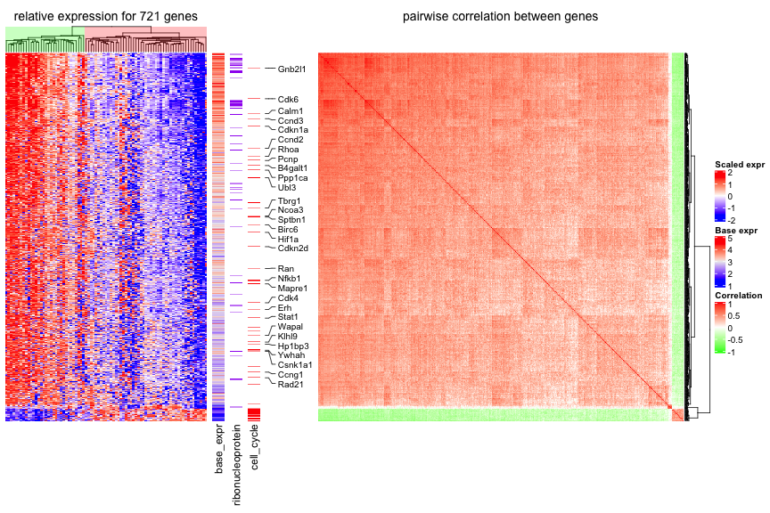

## Annotation as components are adjusted


```r
ha1 = HeatmapAnnotation(foo1 = 1:10, annotation_name_side = "left")
ht1 = Heatmap(mat1, name = "rnorm", col = col_rnorm, top_annotation = ha1)
ht2 = Heatmap(mat2, name = "runif", col = col_runif)
ht3 = Heatmap(le, name = "letters", col = col_letters)
ht1 + ht2 + ht3
```


```r
ha1 = HeatmapAnnotation(foo1 = 1:10, bar1 = anno_points(1:10), annotation_name_side = "left")
ha2 = HeatmapAnnotation(bar2 = anno_barplot(1:10))
ht1 = Heatmap(mat1, name = "rnorm", col = col_rnorm, top_annotation = ha1)
ht2 = Heatmap(mat2, name = "runif", col = col_runif, top_annotation = ha2)
ht3 = Heatmap(le, name = "letters", col = col_letters)
ht_list = ht1 + ht2 + ht3
draw(ht_list, ht_gap = unit(c(6, 2), "mm"))
```


```r
ha1 = HeatmapAnnotation(foo1 = 1:10, annotation_name_side = "left")
ha2 = HeatmapAnnotation(bar2 = anno_barplot(1:10))
ht1 = Heatmap(mat1, name = "rnorm", col = col_rnorm, top_annotation = ha1)
ht2 = Heatmap(mat2, name = "runif", col = col_runif, top_annotation = ha2)
ht3 = Heatmap(le, name = "letters", col = col_letters)
ht_list = ht1 + ht2 + ht3
draw(ht_list, ht_gap = unit(c(6, 2), "mm"))
```


```r
ha1 = HeatmapAnnotation(foo1 = 1:10, bar1 = anno_points(1:10), annotation_name_side = "left")
ht1 = Heatmap(mat1, name = "rnorm", col = col_rnorm, bottom_annotation = ha1)
ht2 = Heatmap(mat2, name = "runif", col = col_runif)
ht3 = Heatmap(le, name = "letters", col = col_letters)
ht_list = ht1 + ht2 + ht3
draw(ht_list)
```

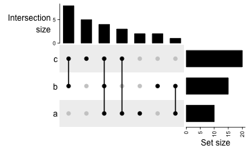


## concatenate with annotations

For horizontal concatenation with the annotaions.


```r
ha1 = rowAnnotation(foo = 1:12, bar = anno_barplot(1:12, width = unit(4, "cm")))
ht1 = Heatmap(mat1, name = "rnorm", col = col_rnorm, row_km = 2)
ht1 + ha1
```


```r
Heatmap(mat1, name = "rnorm", col = col_rnorm, row_km = 2) + 
    rowAnnotation(foo = 1:12) +
    rowAnnotation(bar = anno_barplot(1:12, width = unit(4, "cm")))
```

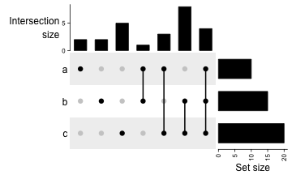


```r
Heatmap(mat1, name = "rnorm", col = col_rnorm, row_km = 2) + 
    rowAnnotation(foo = 1:12) +
    rowAnnotation(bar = anno_barplot(1:12, width = unit(4, "cm"))) +
    Heatmap(mat2, name = "runif", col = col_runif)
```

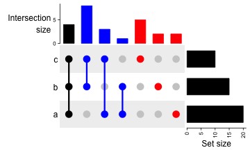


## Only annotations


```r
rowAnnotation(foo = 1:12) +
    rowAnnotation(bar = anno_barplot(1:12, width = unit(4, "cm")))
```

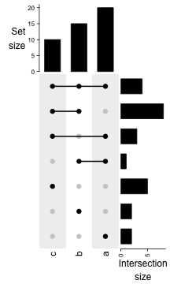

```
## Since all heatmaps/annotations have absolute units, the total width of the plot is 64mm
```


```r
rowAnnotation(bar = anno_barplot(1:12, width = unit(4, "cm"))) + NULL
```

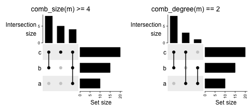

```
## Since all heatmaps/annotations have absolute units, the total width of the plot is 46mm
```

## vertical align


```r
mat1t = t(mat1)
mat2t = t(mat2)
ht1 = Heatmap(mat1t, name = "rnorm", col = col_rnorm)
ht2 = Heatmap(mat2t, name = "runif", col = col_runif)
ht3 = Heatmap(rbind(letters = le), name = "letters", col = col_letters)
ht_list = ht1 %v% ht2 %v% ht3
draw(ht_list)
```

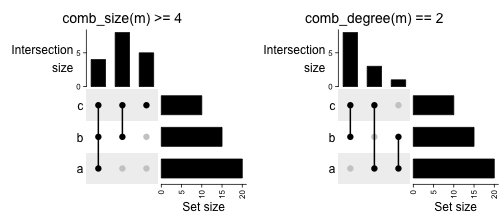

```r
draw(ht_list, column_km = 2)
```


```r
ht1 = Heatmap(mat1t, name = "rnorm", col = col_rnorm)
ht2 = Heatmap(mat2t, name = "runif", col = col_runif)
ht3 = Heatmap(rbind(letters = le), name = "letters", col = col_letters)
ha = HeatmapAnnotation(foo = anno_barplot(1:12, height = unit(2, "cm")))
ht_list = ht1 %v% ha %v% ht2 %v% ht3
draw(ht_list, column_km = 2)
```

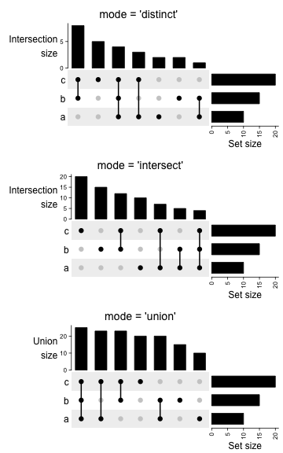


```r
ht1 = Heatmap(mat1t, name = "rnorm", col = col_rnorm, row_km = 2)
ht2 = Heatmap(mat2t, name = "runif", col = col_runif, row_km = 2)
ht3 = Heatmap(rbind(letters = le), name = "letters", col = col_letters)
ha = HeatmapAnnotation(foo = anno_barplot(1:12, height = unit(2, "cm")))
ht_list = ht1 %v% ha %v% ht2 %v% ht3
draw(ht_list, column_km = 2)
```

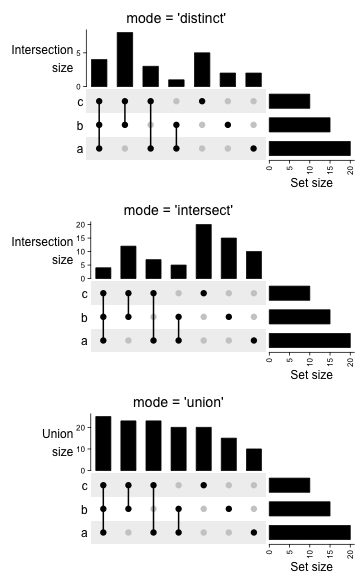

## Retrieve orders and dendrograms

`row_order`, `column_order`, `row_dend` and `column_dend` can be used to retrieve corresponding information from
the heatmaps. The usage is straightforward by following example:


```r
ht1 = Heatmap(mat1, name = "rnorm", col = col_rnorm)
ht2 = Heatmap(mat2, name = "runif", col = col_runif)
ht_list = ht1 + ht2
ht_list = draw(ht_list)
```


```r
row_order(ht_list)
```

```
##  [1]  8  6 10 11  5  7  9  2 12  4  1  3
```

```r
column_order(ht_list)
```

```
## $rnorm
##  [1]  2  7  5  6 10  1  9  8  4  3
## 
## $runif
##  [1]  1  3  8  7  6  9  4 10  2  5
```


```r
ht1 = Heatmap(mat1, name = "rnorm", col = col_rnorm)
ht2 = Heatmap(mat2, name = "runif", col = col_runif, column_km = 2)
ht_list = ht1 + ht2
ht_list = draw(ht_list, row_km = 2)
```

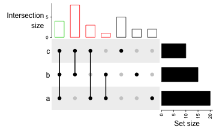

```r
row_order(ht_list)
```

```
## $`1`
## [1] 12  4  1  3
## 
## $`2`
## [1]  8  6 10 11  5  7  9  2
```

```r
column_order(ht_list)
```

```
## $rnorm
## $rnorm[[1]]
##  [1]  2  7  5  6 10  1  9  8  4  3
## 
## 
## $runif
## $runif$`1`
## [1] 1 3 8 7 6 9
## 
## $runif$`2`
## [1]  4 10  2  5
```

Same logic for vertical ... which we will not show here

## Change graphic parameters simultaneously

`ht_opt()` can set graphic parameters for dimension names and titles as global settings.


```r
ht_opt
```

```
##                   Option Value
##     heatmap_row_names_gp  NULL
##  heatmap_column_names_gp  NULL
##     heatmap_row_title_gp  NULL
##  heatmap_column_title_gp  NULL
##          legend_title_gp  NULL
##    legend_title_position  NULL
##         legend_labels_gp  NULL
##       legend_grid_height  NULL
##        legend_grid_width  NULL
##            legend_border  NULL
##           heatmap_border  NULL
##        annotation_border  NULL
##              fast_hclust FALSE
##                  verbose FALSE
##           show_vp_border FALSE
##         anno_simple_size   5mm
##       DENDROGRAM_PADDING 0.5mm
##          DIMNAME_PADDING   1mm
##            TITLE_PADDING 2.5mm
##      COLUMN_ANNO_PADDING   1mm
##         ROW_ANNO_PADDING   1mm
```


```r
ht_opt(heatmap_column_names_gp = gpar(fontface = "italic"), 
    heatmap_column_title_gp = gpar(fontsize = 10),
    legend_border = "black",
    heatmap_border = TRUE,
    annotation_border = TRUE
)
ht1 = Heatmap(mat1, name = "ht1", column_title = "Heatmap 1",
    top_annotation = HeatmapAnnotation(foo = 1:10))
ht2 = Heatmap(mat2, name = "ht2", column_title = "Heatmap 2",
    top_annotation = HeatmapAnnotation(bar = 1:10))
ht1 + ht2
```

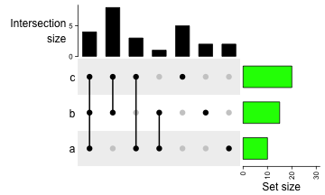

```r
ht_opt(RESET = TRUE)
```

Following are global settings supported by `ht_global_opt()`. By this function, you can also control settings
for the legends.

## Session info


```r
sessionInfo()
```

```
## R version 3.3.1 (2016-06-21)
## Platform: x86_64-pc-linux-gnu (64-bit)
## Running under: openSUSE 13.1 (Bottle) (x86_64)
## 
## locale:
##  [1] LC_CTYPE=en_US.UTF-8       LC_NUMERIC=C              
##  [3] LC_TIME=en_US.UTF-8        LC_COLLATE=en_US.UTF-8    
##  [5] LC_MONETARY=en_US.UTF-8    LC_MESSAGES=en_US.UTF-8   
##  [7] LC_PAPER=en_US.UTF-8       LC_NAME=C                 
##  [9] LC_ADDRESS=C               LC_TELEPHONE=C            
## [11] LC_MEASUREMENT=en_US.UTF-8 LC_IDENTIFICATION=C       
## 
## attached base packages:
## [1] grid      stats     graphics  grDevices utils     datasets  methods  
## [8] base     
## 
## other attached packages:
## [1] knitr_1.20          colorspace_1.3-2    circlize_0.4.4     
## [4] RColorBrewer_1.1-2  GlobalOptions_0.1.0 GetoptLong_0.1.7   
## [7] colorout_1.2-0     
## 
## loaded via a namespace (and not attached):
## [1] microbenchmark_1.4-4 rjson_0.2.20         magrittr_1.5        
## [4] tools_3.3.1          stringi_1.2.4        highr_0.7           
## [7] stringr_1.3.1        shape_1.4.4          evaluate_0.11
```
