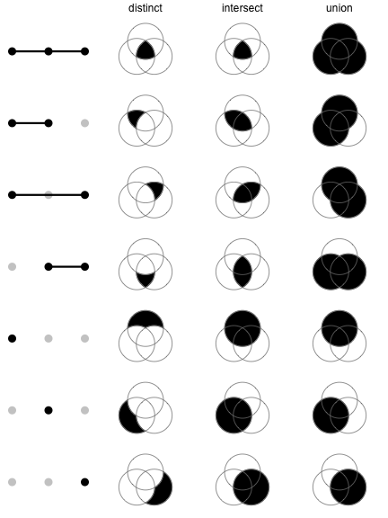
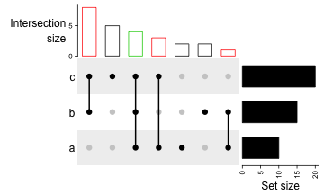
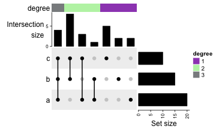
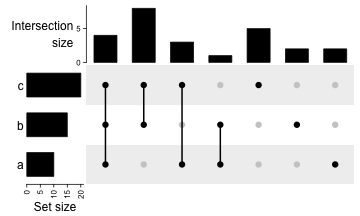
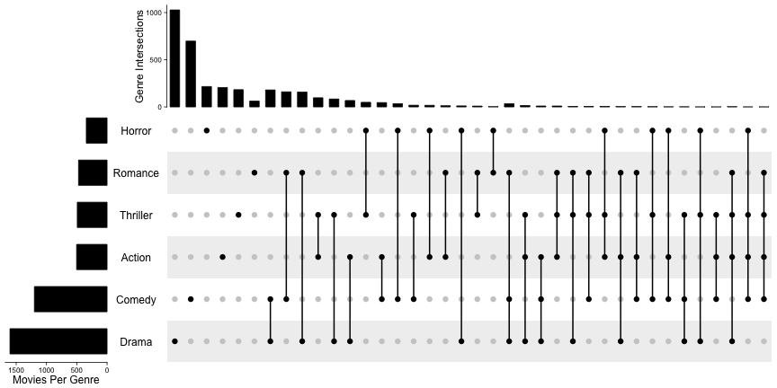
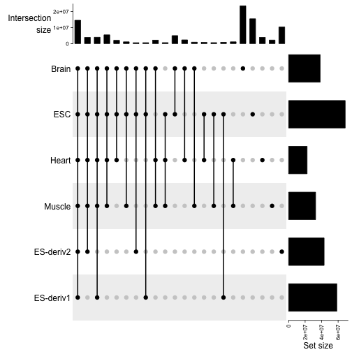

# Legend

The heatmaps and simple annotations automatically generate legends which are
put one the right side of the plot. By default there is no legend for complex
annotations, but they can be constructed and added manually. All legends are
constructed by `Legend()` contructor. In later sections, we first introduce
the settings for continuous legends and discrete legends.

All the legends (no matter a single legend or a pack of legends) all belong to
the `Legends` class. The class only has one slot `grob` which is the real
`grob` object or the `gTree` object that records how to draw the graphics. The
wrapping of the `Legends` class and the methods designed for it makes legends
as a complex and compacted objects and can be draw like points with specifying
the position of the legends.

## Continuous legend

Since most of heatmaps contain continuous values, we first introduce the
settings for continous legend. Continuous legend needs a color mapping
function which should be generated by `circlize::colorRamp2()`. In the heatmap
legends and annotation legends that are automatically generated, the color
mapping functions are passed by the `col` argument from `Heatmap()` or
`HeatmapAnnotation()` function, while if you construct a separate legend, you
need to provide the color mapping function.

The breaks provides in the color mapping function (e.g. `c(0, 0.5, 1)`) will
not exactly be the same as the breaks in the legends). The finally break values
presented in the legend are internally adjusted to make the numbers close to 5.


First we show the default style of a vertical continuous legend:


```r
library(circlize)
col_fun = colorRamp2(c(0, 0.5, 1), c("blue", "white", "red"))
lgd = Legend(col_fun = col_fun, title = "foo")
```




`lgd` is a `Legends` class object. The size of the legend can be obtained by `width()`
and `height()` function.


```r
width(lgd)
```

```
## [1] 10.2916666666667mm
```

```r
# the three values are the height of the title, the gap between title and legend, 
# and the height of the legend. 
height(lgd)
```

```
## [1] 2.82222222222222mm+1.5mm+24mm
```

The legend which is as a packed graphic objects composed of rectangles, lines, text can be
added by `draw()` function. In **ComplexHeatmap** pacakge, you don't need to use `draw()` directly
on legend objects, but it might be useful if you use the legend objects in other places.


```r
# code only for demonstration
draw(lgd, x = , y = , just = )
```

In following examples, we only show how to construct the legend object, while
not show the code which draw the legends.

You can manually adjust the break values in the legend. Note the height is automatically adjusted.


```r
lgd = Legend(col_fun = col_fun, title = "foo", at = c(0, 0.25, 0.5, 0.75, 1))
```


The labels corresponding to the break values


```r
lgd = Legend(col_fun = col_fun, title = "foo", at = c(0, 0.5, 1), labels = c("low", "median", "high"))
```


The height of the vertical continous legend, `legend_height` can only be set for 
the veritcal continous legend, the size is the height of the legend body (exluding
the legend title)


```r
lgd = Legend(col_fun = col_fun, title = "foo", legend_height = unit(6, "cm"))
```


If it is vertical legend, `grid_width` controls the widths of the legend body. `grid_width` is designed for the discrete legends where the each .. is grid, but
here we use the same naem...


```r
lgd = Legend(col_fun = col_fun, title = "foo", grid_width = unit(1, "cm"))
```


The graphic parameters for the labels are controlled by `labels_gp`.


```r
lgd = Legend(col_fun = col_fun, title = "foo", labels_gp = gpar(col = "red", font = 3))
```


The border of the legend body as well as the ticks for the break values.


```r
lgd = Legend(col_fun = col_fun, title = "foo", border = "red")
```


Position of `title_position` has four possible values: `topleft`, `topcenter`,
`lefttop-rot` and `leftcenter-rot`.


```r
lgd = Legend(col_fun = col_fun, title = "foooooooo", title_position = "lefttop-rot",
    legend_height = unit(4, "cm"))
```


```r
lgd = Legend(col_fun = col_fun, title = "foooooooo", title_position = "leftcenter-rot",
    legend_height = unit(4, "cm"))
```



Settings for horizontal continuous legends are almost the same as vertical legends.
now `legend_width` controls the width of the legend, and the title position can
only be one of `topcenter`, `topleft`, `lefttop` and `leftcenter`.

The default style:


```r
lgd = Legend(col_fun = col_fun, title = "foo", direction = "horizontal")
```


manually set `at`:


```r
lgd = Legend(col_fun = col_fun, title = "foo", at = c(0, 0.25, 0.5, 0.75, 1), 
    direction = "horizontal")
```



Manually set `labels`:


```r
lgd = Legend(col_fun = col_fun, title = "foo", at = c(0, 0.5, 1), 
    labels = c("low", "median", "high"), direction = "horizontal")
```



Set `legend_width`:


```r
lgd = Legend(col_fun = col_fun, title = "foo", legend_width = unit(6, "cm"), direction = "horizontal")
```


Set graphic parameters for labels:


```r
lgd = Legend(col_fun = col_fun, title = "foo", labels_gp = gpar(col = "red", font = 3), 
    direction = "horizontal")
```


Title can be set as `topleft`, "topcenter" or `lefttop` and `leftcenter`.


```r
lgd = Legend(col_fun = col_fun, title = "foooooooo", direction = "horizontal", 
    title_position = "topcenter")
```


```r
lgd = Legend(col_fun = col_fun, title = "foooooooo", direction = "horizontal", 
    title_position = "lefttop")
```



In examples we showed above, the intervals between every two break values are equal. `at` can also be set as breaks with uneuqal intervals.


```r
lgd = Legend(col_fun = col_fun, title = "foo", at = c(0, 0.1, 0.15, 0.5, 0.9, 0.95, 1))
```


If the positions do not need to be adjusted, there will be no links.


```r
lgd = Legend(col_fun = col_fun, title = "foo", at = c(0, 0.3, 1), legend_height = unit(4, "cm"))
```




```r
lgd = Legend(col_fun = col_fun, title = "foo", at = c(0, 0.1, 0.15, 0.5, 0.9, 0.95, 1),
    direction = "horizontal")
```


Set rotations of labels to 90.


```r
lgd = Legend(col_fun = col_fun, title = "foo", at = c(0, 0.1, 0.15, 0.5, 0.9, 0.95, 1),
    direction = "horizontal", title_position = "lefttop", labels_rot = 90)
```


If the labels are cumtomized test


```r
lgd = Legend(col_fun = col_fun, title = "foo", at = c(0, 0.1, 0.5, 0.75, 1),
    labels = c("mininal", "q10", "median", "q75", "maximal"),
    direction = "horizontal", title_position = "lefttop")
```


## Discrete legend

Discrete legends are used for discrete color mapping, but can also for continuous
color mapping that it only show the colors for the break values.


```r
lgd = Legend(at = 1:6, title = "foo", legend_gp = gpar(fill = 1:6))
```


```r
lgd = Legend(labels = month.name[1:6], title = "foo", legend_gp = gpar(fill = 1:6))
```


```r
lgd = Legend(labels = month.name[1:6], title = "foo", legend_gp = gpar(fill = 1:6),
    title_position = "lefttop")
```


```r
lgd = Legend(labels = month.name[1:6], title = "foo", legend_gp = gpar(fill = 1:6),
    title_position = "leftcenter-rot")
```


```r
lgd = Legend(at = 1:6, legend_gp = gpar(fill = 1:6), grid_height = unit(1, "cm"), 
    title = "foo", grid_width = unit(5, "mm"))
```


```r
lgd = Legend(labels = month.name[1:6], legend_gp = gpar(fill = 1:6), title = "foo", 
    labels_gp = gpar(col = "red", fontsize = 14))
```


```r
lgd = Legend(labels = month.name[1:6], legend_gp = gpar(fill = 1:6), title = "foo", 
    title_gp = gpar(col = "red", fontsize = 14))
```


```r
lgd = Legend(labels = month.name[1:6], legend_gp = gpar(fill = 1:6), title = "foo", 
    border = "red")
```


# layout of discrete legends


```r
lgd = Legend(labels = month.name[1:10], legend_gp = gpar(fill = 1:10), title = "foo", 
    ncol = 3)
```


```r
lgd = Legend(labels = month.name[1:10], legend_gp = gpar(fill = 1:10), title = "foo", 
    ncol = 3, title_position = "topcenter")
```


```r
lgd = Legend(labels = month.name[1:10], legend_gp = gpar(fill = 1:10), title = "foo", 
    ncol = 3, by_row = TRUE)
```


```r
lgd = Legend(labels = month.name[1:10], legend_gp = gpar(fill = 1:10), title = "foo", 
    ncol = 3, gap = unit(1, "cm"))
```


```r
lgd = Legend(labels = month.name[1:10], legend_gp = gpar(fill = 1:10), title = "foo", 
    nrow = 3)
```


```r
lgd = Legend(labels = month.name[1:6], legend_gp = gpar(fill = 1:6), title = "foooooo", 
    nrow = 1, title_position = "lefttop-rot")
```


```r
lgd = Legend(labels = month.name[1:6], legend_gp = gpar(fill = 1:6), title = "foooooo", 
    nrow = 1, title_position = "leftcenter")
```


`Legend()` supports to use simple graphics (e.g. points, lines) as legends.
`type` argument can be specified as `points` that you can use number for `pch`
or single-letter for `pch`.


```r
lgd = Legend(labels = month.name[1:6], title = "foo", type = "points", 
    pch = 1:6, legend_gp = gpar(col = 1:6), background = "#FF8080")
```


```r
lgd = Legend(labels = month.name[1:6], title = "foo", type = "points", 
    pch = letters[1:6], legend_gp = gpar(col = 1:6), background = "white")
```


```r
lgd = Legend(labels = month.name[1:6], title = "foo", type = "lines", 
    legend_gp = gpar(col = 1:6, lty = 1:6), grid_width = unit(1, "cm"))
```


## A list of legends

A list of legends can also be constructed or packed as a `Legends` object where
the individual legens are arranged in a certain layout. The legend list can be sent to `packLegend()` separatedly or as a list. The legend can be arranged either
vertially or horizontally. 


```r
lgd1 = Legend(at = 1:6, legend_gp = gpar(fill = 1:6), title = "legend1")
lgd2 = Legend(col_fun = col_fun, title = "legend2", at = c(0, 0.25, 0.5, 0.75, 1))
lgd3 = Legend(labels = month.name[1:3], legend_gp = gpar(fill = 7:9), title = "legend3")

pd = packLegend(lgd1, lgd2, lgd3)
pd = packLegend(list = list(lgd1, lgd2, lgd3))
```


```r
pd = packLegend(lgd1, lgd2, lgd3, direction = "horizontal")
```


One feature of `packLegend()` is, e.g. if the packing is vertically and the
sum of the packed legends exceeds the height specified by `max_height`, it
will be rearragned as mutliple column layout. In following, the maximum height 
is the height of the plotting page.


This also takes account of the gaps between legneds:


```r
pd = packLegend(lgd1, lgd3, lgd2, lgd3, lgd2, lgd1, max_height = unit(10, "cm"), column_gap = unit(1, "cm"))
```


```r
draw(pd, test = TRUE)
```


Similar for horizontal packing


```r
lgd1 = Legend(at = 1:6, legend_gp = gpar(fill = 1:6), title = "legend1",
    nr = 1)
lgd2 = Legend(col_fun = col_fun, title = "legend2", at = c(0, 0.25, 0.5, 0.75, 1),
    direction = "horizontal")

pd = packLegend(lgd1, lgd2, lgd3, lgd1, lgd2, lgd3, max_width = unit(10, "cm"), 
    direction = "horizontal", column_gap = unit(5, "mm"), row_gap = unit(1, "cm"))
```


```r
draw(pd, test = TRUE)
```


## heatmap and annotation legend


```r
m = matrix(rnorm(100), 10)
Heatmap(m, name = "foo", heatmap_legend_param = list(
    at = c(-2, 0, 2),
    labels = c("low", "zero", "high"),
    title = "Some values",
    legend_height = unit(4, "cm"),
    title_position = "lefttop-rot"
))
```


```r
ha = HeatmapAnnotation(foo = runif(10), bar = sample(c("f", "m"), 10, replace = TRUE),
    annotation_legend_param = list(
        foo = list(
                title = "Fooooooo",
                at = c(0, 0.5, 1),
                labels = c("zero", "median", "one")
            ),
        bar = list(
                title = "Baaaaaaar",
                at = c("f", "m"),
                labels = c("Female", "Male")
            )
))
```


```r
ha = HeatmapAnnotation(foo = runif(10), bar = sample(c("f", "m"), 10, replace = TRUE))
Heatmap(m, name = "mat1", top_annotation = ha) +
Heatmap(m, name = "mat1", top_annotation = ha)
```

```
## Warning in .local(object, ...): Heatmap/annotation names are duplicated:
## mat1
```


```r
ha = HeatmapAnnotation(foo = runif(10), 
    bar = sample(c("f", "m"), 10, replace = TRUE),
    show_legend = c(TRUE, FALSE),
    annotation_name_side = "left")
Heatmap(m, name = "mat1", top_annotation = ha) +
Heatmap(m, name = "mat2", show_heatmap_legend = FALSE)
```


If heatmaps / annotations are added horizontally, heatmap legends and row annotations are put in one
viewport and column annotations are put in another viewport


```r
ha1 = HeatmapAnnotation(foo1 = runif(10), 
    bar1 = sample(c("f", "m"), 10, replace = TRUE))
ha2 = rowAnnotation(foo2 = runif(10), 
    bar2 = sample(letters[1:3], 10, replace = TRUE))
ha3 = rowAnnotation(foo3 = runif(10), 
    bar3 = sample(month.name[1:3], 10, replace = TRUE))
ht_list = Heatmap(m, name = "mat1", top_annotation = ha1) + 
    Heatmap(m, name = "mat2", left_annotation = ha2) + 
    ha3
draw(ht_list, heatmap_legend_side = "bottom", annotation_legend_side = "left")
```


```r
draw(ht_list, merge_legend = TRUE)
```


```r
draw(ht_list, annotation_offset = "anno_top")
```

```
## Error in .local(object, ...): unused argument (annotation_offset = "anno_top")
```

To add customized legend.

