# Legends {#legends}

The heatmaps and simple annotations automatically generate legends which are put one the right side
of the heatmap. By default there is no legend for complex annotations, but they can be constructed
and added manually. All legends are constructed by `Legend()` contructor. In later sections, we
first introduce the settings for continuous legends and discrete legends, then we will discuss how
to configure the legends associated with the heatmaps and annotations, and how to add new legends to
the plot.

All the legends (no matter a single legend or a pack of legends) all belong to the `Legends` class.
The class only has one slot `grob` which is the real `grid::grob` object or the `grid::gTree` object
that records how to draw the graphics. The wrapping of the `Legends` class and the methods designed
for the class make legends as single compacted objects and can be draw like points with specifying
the positions of the legends.

The legends for heatmaps and annotations can be controlled by `heatmap_legend_param` argument in
`Heatmap()`, or `annotation_legend_param` argument in `HeatmapAnnotation()`. Most of the parameters
in `Legend()` function can be set in the two argument with the same parameter name. The details of
setting heatmap legends and annotation legends parameters are introduced in Section \@ref().

## Continuous legend {#continuous-legends}

Since most of heatmaps contain continuous values, we first introduce the settings for continuous
legend. Continuous legend needs a color mapping function which should be generated by
`circlize::colorRamp2()`. In the heatmap legends and annotation legends that are automatically
generated, the color mapping functions are passed by the `col` argument from `Heatmap()` or
`HeatmapAnnotation()` function, while if you construct a self-defined legend, you need to provide the
color mapping function.

The break values provides in the color mapping function (e.g. `c(0, 0.5, 1)`) will not exactly be
the same as the break values in the legends). The finally break values presented in the legend are
internally adjusted to make the numbers of labels close to 5 or 6.

First we show the default style of a vertical continuous legend:


```r
library(circlize)
col_fun = colorRamp2(c(0, 0.5, 1), c("blue", "white", "red"))
lgd = Legend(col_fun = col_fun, title = "foo")
```


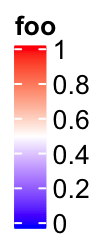

`lgd` is a `Legends` class object. The size of the legend can be obtained by `width()`
and `height()` function.


```r
width(lgd)
```

```
## [1] 9.90361111111111mm
```

```r
# the three values are the height of the title, the gap between title and legend, 
# and the height of the legend. 
height(lgd)
```

```
## [1] 2.53294444444445mm+1.5mm+24mm
```

The legend is actually a packed graphic object composed of rectangles, lines, text. It can be
added to the plot by `draw()` function. In **ComplexHeatmap** pacakge, you don't need to use `draw()` directly
on legend objects, but it might be useful if you use the legend objects in other places.


```r
pushViewport(viewport(width = 0.9, height = 0.9))
grid.rect()  # border
draw(lgd, x = unit(1, "cm"), y = unit(1, "cm"), just = c("left", "bottom"))
draw(lgd, x = unit(0.5, "npc"), y = unit(0.5, "npc"))
draw(lgd, x = unit(1, "npc"), y = unit(1, "npc"), just = c("right", "top"))
popViewport()
```

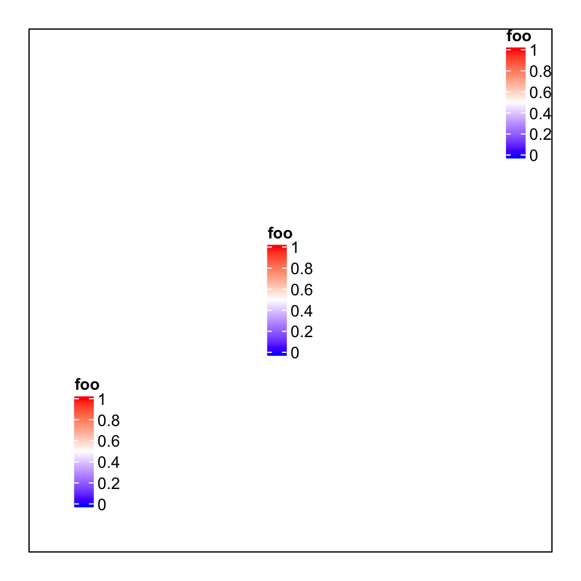

If you only want to configure the legends generated by heatmaps or annotations, you don't need to
construct the `Legends` object by your own, but the parameters introduced later can be used to
customize the legends by `heatmap_legend_param` argument in `Heatmap()` and
`annotation_legend_param` argument in `HeatmapAnnotation()`. It is still nice to see how these
parameters change the styles of the legend in following examples.

In following examples, we only show how to construct the legend object, while not show the code
which draws the legends. Only remember you can use `draw()` function on the `Legends` object to draw
the single legend on the plot.

For continuous legend, you can manually adjust the break values in the legend by setting `at`. Note
the height is automatically adjusted.


```r
lgd = Legend(col_fun = col_fun, title = "foo", at = c(0, 0.25, 0.5, 0.75, 1))
```


The labels corresponding to the break values are set by `labels`.


```r
lgd = Legend(col_fun = col_fun, title = "foo", at = c(0, 0.5, 1), 
    labels = c("low", "median", "high"))
```


The height of the vertical continous legend is set by `legend_height`. `legend_height` can only be
set for the veritcal continous legend and the value is the height of the legend body (exluding the
legend title).


```r
lgd = Legend(col_fun = col_fun, title = "foo", legend_height = unit(6, "cm"))
```

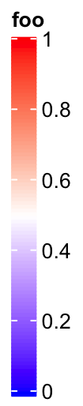

If it is a vertical legend, `grid_width` controls the widths of the legend body. `grid_width` is
originally designed for the discrete legends where the each level in the legend is a grid, but here
we use the same name for the parameter that controls the width of the legend.


```r
lgd = Legend(col_fun = col_fun, title = "foo", grid_width = unit(1, "cm"))
```

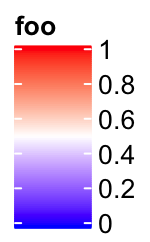

The graphic parameters for the labels are controlled by `labels_gp`.


```r
lgd = Legend(col_fun = col_fun, title = "foo", labels_gp = gpar(col = "red", font = 3))
```

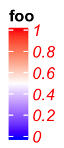

The border of the legend as well as the ticks for the break values are controlled by `border`.
The value of `border` can be logical or a string of color.


```r
lgd = Legend(col_fun = col_fun, title = "foo", border = "red")
```


`title_position` controls the position of titles. For vertical legends, the value should be one of
`topleft`, `topcenter`, `lefttop-rot` and `leftcenter-rot`. Following two shows the effect
of `lefttop-rot` title and `leftcenter-rot` title.


```r
lgd = Legend(col_fun = col_fun, title = "foooooooo", title_position = "lefttop-rot",
    legend_height = unit(4, "cm"))
```

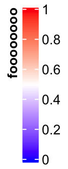


```r
lgd = Legend(col_fun = col_fun, title = "foooooooo", title_position = "leftcenter-rot",
    legend_height = unit(4, "cm"))
```

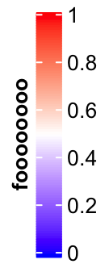

Settings for horizontal continuous legends are almost the same as vertical legends, except that
now `legend_width` controls the width of the legend, and the title position can
only be one of `topcenter`, `topleft`, `lefttop` and `leftcenter`.

The default style for horizontal legend:


```r
lgd = Legend(col_fun = col_fun, title = "foo", direction = "horizontal")
```

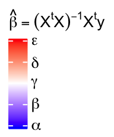

Manually set `at`:


```r
lgd = Legend(col_fun = col_fun, title = "foo", at = c(0, 0.25, 0.5, 0.75, 1), 
    direction = "horizontal")
```


Manually set `labels`:


```r
lgd = Legend(col_fun = col_fun, title = "foo", at = c(0, 0.5, 1), 
    labels = c("low", "median", "high"), direction = "horizontal")
```


Set `legend_width`:


```r
lgd = Legend(col_fun = col_fun, title = "foo", legend_width = unit(6, "cm"), 
    direction = "horizontal")
```

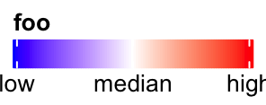

Set graphic parameters for labels:


```r
lgd = Legend(col_fun = col_fun, title = "foo", labels_gp = gpar(col = "red", font = 3), 
    direction = "horizontal")
```


Title can be set as `topleft`, `topcenter` or `lefttop` and `leftcenter`.


```r
lgd = Legend(col_fun = col_fun, title = "foooooooo", direction = "horizontal", 
    title_position = "topcenter")
```


```r
lgd = Legend(col_fun = col_fun, title = "foooooooo", direction = "horizontal", 
    title_position = "lefttop")
```

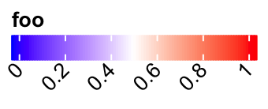

In examples we showed above, the intervals between every two break values are equal. Actually `at`
can also be set as break values with uneuqal intervals. In this scenario, the ticks on the legend
are still at the original places while the corresponding texts are shifted to get rid of overlapping.
Then, there is lines linking the ticks and the texts.


```r
lgd = Legend(col_fun = col_fun, title = "foo", at = c(0, 0.1, 0.15, 0.5, 0.9, 0.95, 1))
```


If the labels do not need to be adjusted, they are still at the original places and there will be no
links.


```r
lgd = Legend(col_fun = col_fun, title = "foo", at = c(0, 0.3, 1), 
    legend_height = unit(4, "cm"))
```


It is similar for the horizontal legends:


```r
lgd = Legend(col_fun = col_fun, title = "foo", at = c(0, 0.1, 0.15, 0.5, 0.9, 0.95, 1),
    direction = "horizontal")
```

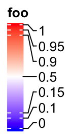

Set rotations of labels to 90 degree.


```r
lgd = Legend(col_fun = col_fun, title = "foo", at = c(0, 0.1, 0.15, 0.5, 0.9, 0.95, 1),
    direction = "horizontal", title_position = "lefttop", labels_rot = 90)
```

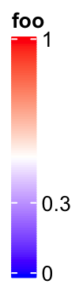

When the position of title is set to `lefttop`, the area below the title will also be taken into
account of calculating the adjusted positions of labels.


```r
lgd = Legend(col_fun = col_fun, title = "foo", at = c(0, 0.1, 0.5, 0.75, 1),
    labels = c("mininal", "q10", "median", "q75", "maximal"),
    direction = "horizontal", title_position = "lefttop")
```

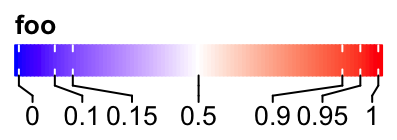


## Discrete legends {#discrete-legends}

Discrete legends are used for discrete color mapping. The continuous color
mapping can be degenerated as discrete color mapping by only providing the colors corresponding
to the break values.

You can either specify `at` or `labels`, but most probably you specify `labels`. The colors
should be specified by `legend_gp`.


```r
lgd = Legend(at = 1:6, title = "foo", legend_gp = gpar(fill = 1:6))
```


```r
lgd = Legend(labels = month.name[1:6], title = "foo", legend_gp = gpar(fill = 1:6))
```


The position of title:


```r
lgd = Legend(labels = month.name[1:6], title = "foo", legend_gp = gpar(fill = 1:6),
    title_position = "lefttop")
```

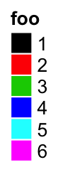


```r
lgd = Legend(labels = month.name[1:6], title = "foo", legend_gp = gpar(fill = 1:6),
    title_position = "leftcenter-rot")
```

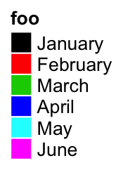

The size of grids are controlled by `grid_width` and `grid_height`.


```r
lgd = Legend(at = 1:6, legend_gp = gpar(fill = 1:6), title = "foo", 
    grid_height = unit(1, "cm"), grid_width = unit(5, "mm"))
```


The graphic parameters of labels are controlled by `labels_gp`.


```r
lgd = Legend(labels = month.name[1:6], legend_gp = gpar(fill = 1:6), title = "foo", 
    labels_gp = gpar(col = "red", fontsize = 14))
```

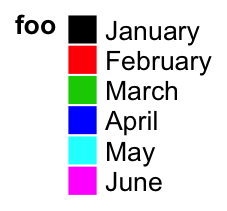

The graphic parameters of the title are controlled by `title_gp`.


```r
lgd = Legend(labels = month.name[1:6], legend_gp = gpar(fill = 1:6), title = "foo", 
    title_gp = gpar(col = "red", fontsize = 14))
```


Borders of grids are controlled by `border`.


```r
lgd = Legend(labels = month.name[1:6], legend_gp = gpar(fill = 1:6), title = "foo", 
    border = "red")
```

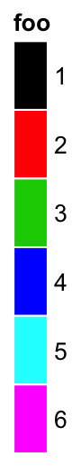

One important thing for the discrete legend is you can arrange the grids into multiple rows or/and
columns. If `ncol` is set to a number, the grids are arranged into `ncol` columns.


```r
lgd = Legend(labels = month.name[1:10], legend_gp = gpar(fill = 1:10), 
    title = "foo", ncol = 3)
```

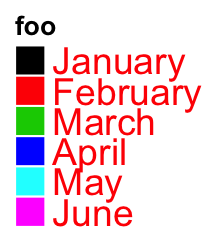

Still the title position is calculated based on the multiplt-column legend.


```r
lgd = Legend(labels = month.name[1:10], legend_gp = gpar(fill = 1:10), title = "foo", 
    ncol = 3, title_position = "topcenter")
```


You can choose to list the legend levels by rows by setting `by_row = TRUE`.


```r
lgd = Legend(labels = month.name[1:10], legend_gp = gpar(fill = 1:10), title = "foo", 
    ncol = 3, by_row = TRUE)
```


The gap between two columns are controlled by `gap`.


```r
lgd = Legend(labels = month.name[1:10], legend_gp = gpar(fill = 1:10), title = "foo", 
    ncol = 3, gap = unit(1, "cm"))
```


Instead of `ncol`, you can also specify the layout by `nrow`. Note you cannot use
`ncol` and `nrow` at a same time.


```r
lgd = Legend(labels = month.name[1:10], legend_gp = gpar(fill = 1:10), 
    title = "foo", nrow = 3)
```


One extreme case is when all levels are put in one row and the title are rotated by 90 degree.
The height of the legend will be the height of the rotated title.


```r
lgd = Legend(labels = month.name[1:6], legend_gp = gpar(fill = 1:6), title = "foooooo", 
    nrow = 1, title_position = "lefttop-rot")
```


Following style a lot of people might like:


```r
lgd = Legend(labels = month.name[1:6], legend_gp = gpar(fill = 1:6), title = "foooooo", 
    nrow = 1, title_position = "leftcenter")
```

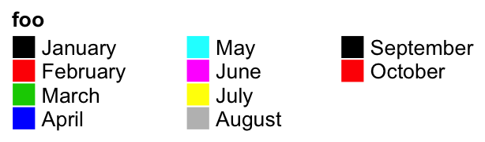


`Legend()` also supports to use simple graphics (e.g. points, lines) as legends.
`type` argument can be specified as `points` that you can use number for `pch`
or single-letter for `pch`.


```r
lgd = Legend(labels = month.name[1:6], title = "foo", type = "points", 
    pch = 1:6, legend_gp = gpar(col = 1:6), background = "#FF8080")
```


```r
lgd = Legend(labels = month.name[1:6], title = "foo", type = "points", 
    pch = letters[1:6], legend_gp = gpar(col = 1:6), background = "white")
```

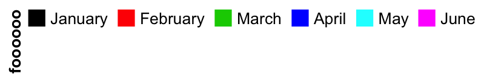

Or set `type = "lines"` to use lines as legend:


```r
lgd = Legend(labels = month.name[1:6], title = "foo", type = "lines", 
    legend_gp = gpar(col = 1:6, lty = 1:6), grid_width = unit(1, "cm"))
```

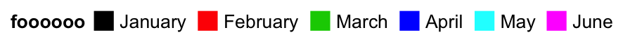

## A list of legends {#a-list-of-legends}

A list of legends can also be constructed or packed as a `Legends` object where the individual
legends are arranged in a certain layout. The legend list can be sent to `packLegend()` separatedly
or as a list. The legend can be arranged either vertically or horizontally.


```r
lgd1 = Legend(at = 1:6, legend_gp = gpar(fill = 1:6), title = "legend1")
lgd2 = Legend(col_fun = col_fun, title = "legend2", at = c(0, 0.25, 0.5, 0.75, 1))
lgd3 = Legend(labels = month.name[1:3], legend_gp = gpar(fill = 7:9), title = "legend3")

pd = packLegend(lgd1, lgd2, lgd3)
# which is same as 
pd = packLegend(list = list(lgd1, lgd2, lgd3))
```

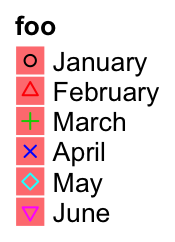

Simillar as single legend, you can draw the packed legends by `draw()` function. Also you can
get the size of `pd` by `width()` and `height()`.


```r
width(pd)
```

```
## [1] 19.1675555555556mm
```

```r
height(pd)
```

```
## [1] 72.0988333333333mm
```

Horizontally arranging the legends simply by setting `direction = "horizontal"`.


```r
pd = packLegend(lgd1, lgd2, lgd3, direction = "horizontal")
```


One feature of `packLegend()` is, e.g. if the packing is vertically and the
sum of the packed legends exceeds the height specified by `max_height`, it
will be rearragned as mutliple column layout. In following example, the maximum height 
is `10cm`.

When all the legends are put into multiple columns, `column_gap` controls the space between
two columns.


```r
pd = packLegend(lgd1, lgd3, lgd2, lgd3, lgd2, lgd1, max_height = unit(10, "cm"), 
    column_gap = unit(1, "cm"))
```


Similar for horizontal packing:


```r
lgd1 = Legend(at = 1:6, legend_gp = gpar(fill = 1:6), title = "legend1",
    nr = 1)
lgd2 = Legend(col_fun = col_fun, title = "legend2", at = c(0, 0.25, 0.5, 0.75, 1),
    direction = "horizontal")

pd = packLegend(lgd1, lgd2, lgd3, lgd1, lgd2, lgd3, max_width = unit(10, "cm"), 
    direction = "horizontal", column_gap = unit(5, "mm"), row_gap = unit(1, "cm"))
```


The packed legends `pd` is also a `Legends` object, which means you can use `draw()` to
draw it by specifying the positions.


```r
pd = packLegend(lgd1, lgd2, lgd3, direction = "horizontal")
pushViewport(viewport(width = 0.8, height = 0.8))
grid.rect()
draw(pd, x = unit(1, "cm"), y = unit(1, "cm"), just = c("left", "bottom"))
popViewport()
```


## Heatmap and annotation legends {#heatmap-and-annotation-legends}

Settings for heatmap legend are controlled by `heatmap_legend_param` argument. The value for
`heatmap_legend_param` is a list of parameters which are supported in `Legend()`.


```r
m = matrix(rnorm(100), 10)
Heatmap(m, name = "mat", heatmap_legend_param = list(
    at = c(-2, 0, 2),
    labels = c("low", "zero", "high"),
    title = "Some values",
    legend_height = unit(4, "cm"),
    title_position = "lefttop-rot"
))
```


`annotation_legend_param` controls legends for annotations. Since a `HeatmapAnnotation` may contain
multiple annotations, the value of `annotation_legend_param` is a list of configurations of each
annotation.


```r
ha = HeatmapAnnotation(foo = runif(10), bar = sample(c("f", "m"), 10, replace = TRUE),
    annotation_legend_param = list(
        foo = list(
                title = "Fooooooo",
                at = c(0, 0.5, 1),
                labels = c("zero", "median", "one")
            ),
        bar = list(
                title = "Baaaaaaar",
                at = c("f", "m"),
                labels = c("Female", "Male")
            )
))
Heatmap(m, top_annotation = ha)
```


All heatmap/row annotation legends are grouped and all column annotation legends ae grouped.


```r
ha1 = HeatmapAnnotation(foo1 = runif(10), bar1 = sample(c("f", "m"), 10, replace = TRUE), 
    annotation_name_side = "left")
ha2 = HeatmapAnnotation(foo2 = runif(10), bar2 = sample(c("f", "m"), 10, replace = TRUE))
Heatmap(m, name = "mat1", top_annotation = ha1) +
rowAnnotation(sth = runif(10)) +
Heatmap(m, name = "mat2", top_annotation = ha2)
```


If the heatmaps are concatenated vertically, all heatmaps/column annotations are grouped and legneds
for all row annotations are grouped.


```r
ha1 = HeatmapAnnotation(foo1 = runif(10), bar1 = sample(c("f", "m"), 10, replace = TRUE), 
    annotation_name_side = "left")
ha2 = HeatmapAnnotation(foo2 = runif(10), bar2 = sample(c("f", "m"), 10, replace = TRUE))
Heatmap(m, name = "mat1", top_annotation = ha1) %v%
Heatmap(m, name = "mat2", top_annotation = ha2, right_annotation = rowAnnotation(sth = 1:10))
```


`show_legend` in `HeatmapAnnotation()` and in `Heatmap()` controls whether show the legends.


```r
ha = HeatmapAnnotation(foo = runif(10), 
    bar = sample(c("f", "m"), 10, replace = TRUE),
    show_legend = c(TRUE, FALSE),
    annotation_name_side = "left")
Heatmap(m, name = "mat1", top_annotation = ha) +
Heatmap(m, name = "mat2", show_heatmap_legend = FALSE)
```


`merge_legend` in `draw()` function controlls whether merge all legends.


```r
ha1 = HeatmapAnnotation(foo1 = runif(10), 
    bar1 = sample(c("f", "m"), 10, replace = TRUE))
ha2 = rowAnnotation(foo2 = runif(10), 
    bar2 = sample(letters[1:3], 10, replace = TRUE))
ha3 = rowAnnotation(foo3 = runif(10), 
    bar3 = sample(month.name[1:3], 10, replace = TRUE))
ht_list = Heatmap(m, name = "mat1", top_annotation = ha1) + 
    Heatmap(m, name = "mat2", left_annotation = ha2) + 
    ha3
draw(ht_list, merge_legend = TRUE)
```

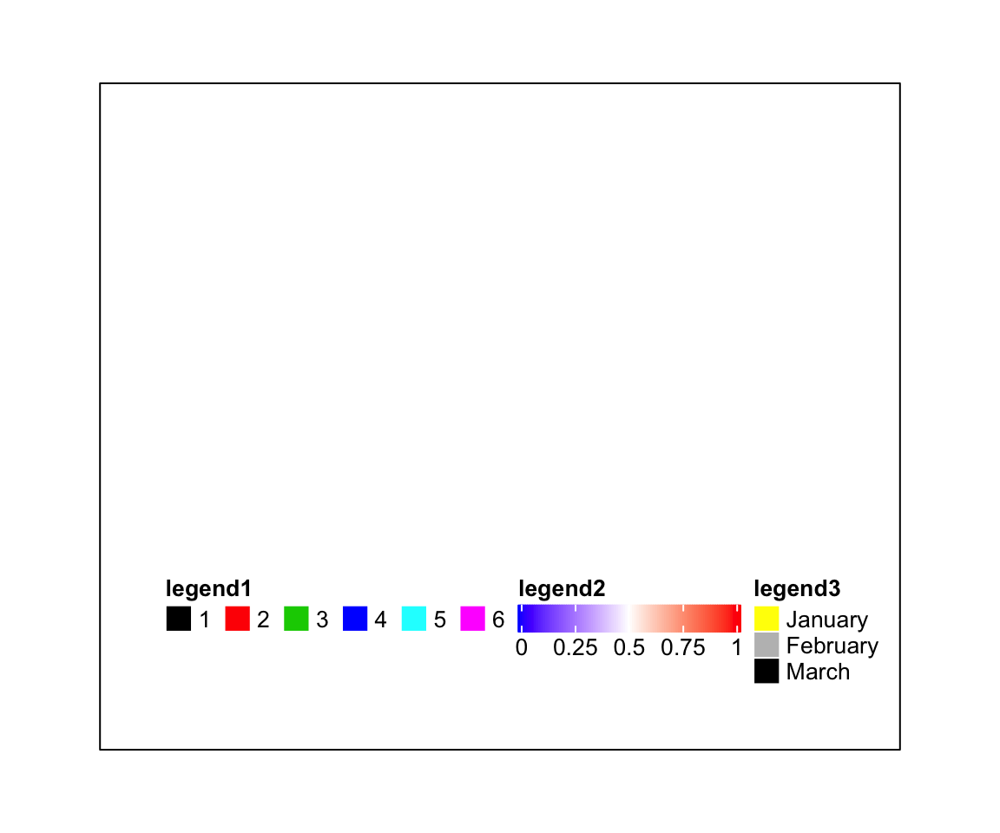

## Add customized legends {#add-customized-legends}

The self-defined legneds (by `Legend()`) can be added to the heatmap legend list by `heatmap_legend_list`
argument in `draw()` and the legend for annotations can be added to the annotation legend list by 
`annotation_legend_list` argument.

