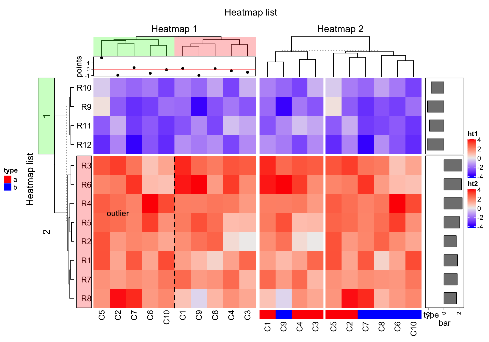
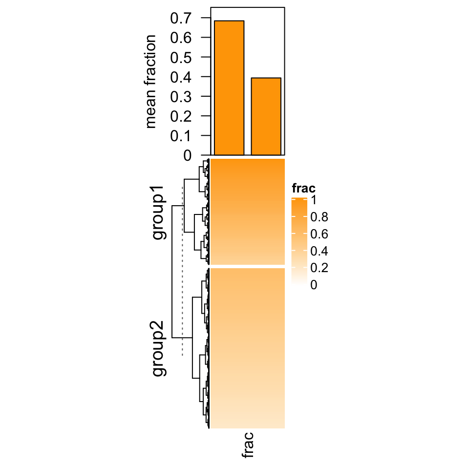
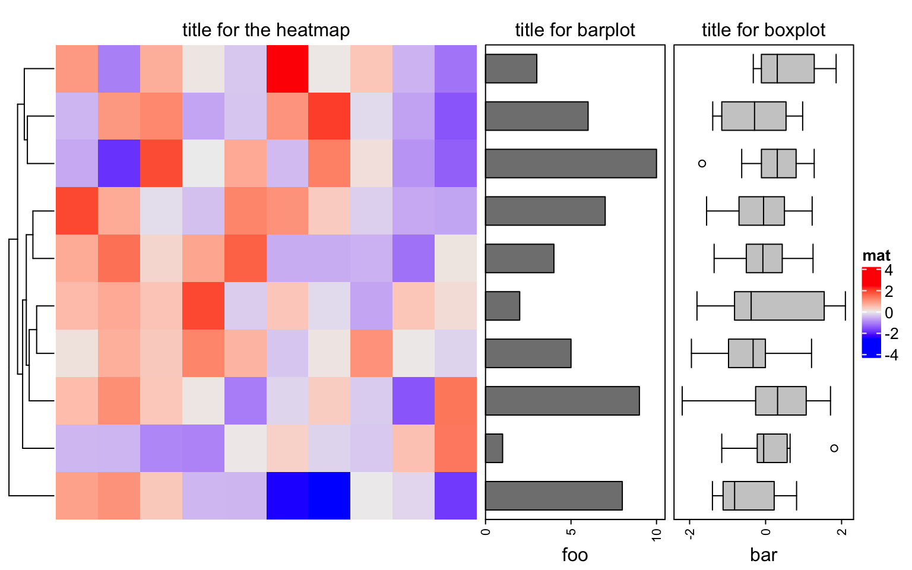

# Heatmap Decoration {#heatmap-decoration}

The plotting region for each heatmap component is still kept after the heatmaps are made, so it is
possible to go back to the original places to add more graphics there. First let's generate a figure
that almost contains all types of heatmap components. `list_components()` lists the names of the
heatmap/annotation components (or the name of the viewport).


```r
mat = matrix(rnorm(80, 2), 8, 10)
mat = rbind(mat, matrix(rnorm(40, -2), 4, 10))
rownames(mat) = paste0("R", 1:12)
colnames(mat) = paste0("C", 1:10)

ha_column1 = HeatmapAnnotation(points = anno_points(rnorm(10)), 
    annotation_name_side = "left")
ht1 = Heatmap(mat, name = "ht1", km = 2, column_title = "Heatmap 1", 
    top_annotation = ha_column1, row_names_side = "left")

ha_column2 = HeatmapAnnotation(type = c(rep("a", 5), rep("b", 5)),
    col = list(type = c("a" = "red", "b" = "blue")))
ht2 = Heatmap(mat, name = "ht2", row_title = "Heatmap 2", column_title = "Heatmap 2",
    bottom_annotation = ha_column2, column_km = 2)

ht_list = ht1 + ht2 + 
    rowAnnotation(bar = anno_barplot(rowMeans(mat), width = unit(2, "cm")))
draw(ht_list, row_title = "Heatmap list", column_title = "Heatmap list")
list_components()
```

```
##  [1] "ROOT"                         "global"                      
##  [3] "global_layout"                "main_heatmap_list"           
##  [5] "heatmap_ht1"                  "ht1_heatmap_body_wrap"       
##  [7] "ht1_heatmap_body_1_1"         "ht1_heatmap_body_2_1"        
##  [9] "ht1_column_title_1"           "ht1_row_title_1"             
## [11] "ht1_row_title_2"              "ht1_dend_row_1"              
## [13] "ht1_dend_row_2"               "ht1_dend_column_1"           
## [15] "ht1_row_names_1"              "ht1_row_names_2"             
## [17] "ht1_column_names_1"           "annotation_points_1"         
## [19] "heatmap_ht2"                  "ht2_heatmap_body_wrap"       
## [21] "ht2_heatmap_body_1_1"         "ht2_heatmap_body_1_2"        
## [23] "ht2_heatmap_body_2_1"         "ht2_heatmap_body_2_2"        
## [25] "ht2_column_title_1"           "ht2_dend_column_1"           
## [27] "ht2_dend_column_2"            "ht2_column_names_1"          
## [29] "ht2_column_names_2"           "annotation_type_1"           
## [31] "annotation_type_2"            "heatmap_heatmap_annotation_2"
## [33] "annotation_bar_1"             "annotation_bar_2"            
## [35] "global_column_title"          "global_row_title"            
## [37] "heatmap_legend"               "annotation_legend"
```


Basically the red regions in above plot can be revisited by `decorate_*()` functions.

## decorate_*() functions {#decorate-functions}

Since you can get the viewport name by `list_components()`, actually you can directly go to
the viewport by `seekViewport()`. To get rid of the complicated viewport name, the `decorate_*()` 
functions provide a more friendly way to do it.

There are following decorate functions in **ComplexHeatmap** package:

- `decorate_annotation()`
- `decorate_column_names()` 
- `decorate_dend()`  
- `decorate_heatmap_body()` 
- `decorate_row_names()`
- `decorate_title()`
- `decorate_column_dend()`
- `decorate_column_title()`
- `decorate_dimnames()`
- `decorate_row_dend()`   
- `decorate_row_title()`

For all these functions, they need a heatmap or annotation name, index for the row/column slices if 
the heatmap is split and a code block which defines how to add graphics. Check following example.


```r
ht_list = draw(ht_list, row_title = "Heatmap list", column_title = "Heatmap list", 
    heatmap_legend_side = "right", annotation_legend_side = "left")

decorate_heatmap_body("ht1", {
    grid.text("outlier", 1.5/10, 2.5/4, default.units = "npc")
    grid.lines(c(0.5, 0.5), c(0, 1), gp = gpar(lty = 2, lwd = 2))
}, slice = 2)

decorate_column_dend("ht1", {
    tree = column_dend(ht_list)$ht1[[1]]
    ind = cutree(as.hclust(tree), k = 2)[order.dendrogram(tree)]

    first_index = function(l) which(l)[1]
    last_index = function(l) { x = which(l); x[length(x)] }
    x1 = c(first_index(ind == 1), first_index(ind == 2)) - 1
    x2 = c(last_index(ind == 1), last_index(ind == 2))
    grid.rect(x = x1/length(ind), width = (x2 - x1)/length(ind), just = "left",
        default.units = "npc", gp = gpar(fill = c("#FF000040", "#00FF0040"), col = NA))
})

decorate_row_names("ht1", {
    grid.rect(gp = gpar(fill = "#FF000040"))
}, slice = 2)

decorate_row_title("ht1", {
    grid.rect(gp = gpar(fill = "#00FF0040"))
}, slice = 1)

decorate_annotation("points", {
    grid.lines(c(0, 1), unit(c(0, 0), "native"), gp = gpar(col = "red"))
})
```



For annotations which are created by `anno_points()`, `anno_barplot()` and `anno_boxplot()`, "native" unit
can be used in the decoration code.

## Examples {#decoration-examples}


### Barplot for single column heatmap {#barplot-for-single-column-heatmap}

In Section \@ref(summary-annotation), we introduced adding barplots as annotations for single-column heatmap.
In that case the heatmap contains discrete values. In following, we show another scenario of using
barplot as annotation but for a continuous heatmap.

Imagining we are analyzing a set of genomic regions (e.g. differentially methylated regions, DMRs) and we
have a single-column heatmap which shows the overlap to e.g. genes (measured by how much of a DMR
is covered by genes, value between 0 and 1). If we denote the width of DMRs as $w$ and the overlap proportion
as $p$, on top of the  proportion heatmap, we want to add barplots to show, on average, how much of the DMRs
are covered by genes. In this case, we need to calcualte the mean proprotion weighted by the width of DMRs
($\sum{w \dot p}/\sum{w}$).

In following code, we randomly generated a proprotion vector and split it into two groups. We first
use `anno_empty()` to allocate some empty plotting regions on top of the heatmap and later we use
`decorate_annotation()` to add the barplots into it.


```r
library(circlize)
bed = generateRandomBed(nr = 1000)
prop = c(runif(400, min = 0.4, max = 1), runif(nrow(bed) - 400, min = 0.2, max = 0.6))
col_fun = colorRamp2(c(0, 1), c("white", "orange"))
split = c(rep("group1", 400), rep("group2", nrow(bed) - 400))
ht = Heatmap(prop, name = "prop", col = col_fun, width = unit(2, "cm"),
    top_annotation = HeatmapAnnotation(barplot = anno_empty(height = unit(4, "cm"))))
ht = draw(ht, row_split = split)
```

```
## Since all heatmaps/annotations have absolute units, the total width of the plot is 55mm
```

```r
ro = row_order(ht)
w = bed[, 3] - bed[, 2]
p = sapply(ro, function(index) {
    sum(w[index]*prop[index])/sum(w[index])
})
decorate_annotation("barplot", {
    pushViewport(viewport(xscale = c(0.5, 2.5), yscale = c(0, max(p)*1.1)))
    grid.rect(x = 1, y = 0, width = 0.8, height = p[1], just = "bottom",
        gp = gpar(fill = "orange"), default.units = "native")
    grid.rect(x = 2, y = 0, width = 0.8, height = p[2], just = "bottom",
        gp = gpar(fill = "orange"), default.units = "native")
    grid.yaxis()
    grid.text("mean proprotion", x = unit(-1.5, "cm"),rot = 90, just = "bottom")
    popViewport()
})
```



### Add decoration for a customized heatmap {#add-decoration-for-a-customized-heatmap}

The usage if this example is more like non-sense, but it shows the decoration helps to
define a more customzed heatmap and still it can be added to other heatmaps.

In following we use an argument `pos_fun` in `Heatmap()` function. `pos_fun` is executed
after all the heatmaps are drawn and it only contains one argument which is the current
`Heatmap` object. Actually this is what `densityHeatmap()` is implemented to add quantile lines
on the heatmap (Section \@ref(density-heatmap)).

In following code, a density lines for the distribution of the matrix is added on the right of
every heatmap.


```r
customized_heatmap = function(m, ...) {

    x = colMeans(m)
    ha = rowAnnotation(empty = anno_empty(width = unit(6, "cm")))
    ha_nm = paste0("nm", runif(1))

    post_fun = function(ht) {
        m = ht@matrix
        den = density(m)

        decorate_annotation(ha_nm, {
            pushViewport(viewport(xscale = range(den$x), yscale = range(den$y)))
            grid.lines(den$x, den$y, default.units = "native")
            popViewport()
        })    
    }

    names(ha) = ha_nm

    Heatmap(m, ..., right_annotation = ha, post_fun = post_fun)
}
m1 = matrix(rnorm(100), nr = 10)
m2 = matrix(runif(100), nr = 10)
customized_heatmap(m1) %v% customized_heatmap(m2)
```



### Other possible use of decorations {#other-possible-use-of-decorations}

There are some scenarios...

- When you have many annotations, you can add lines to separate them
- add titles for the annotations.
