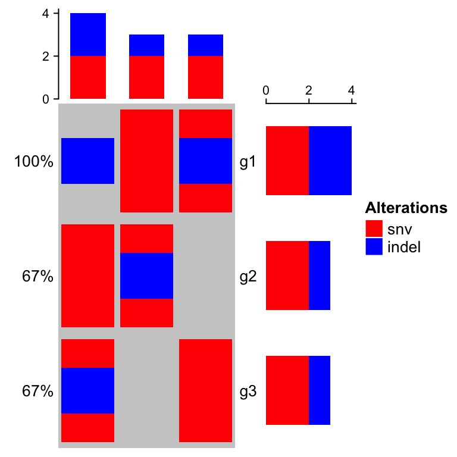
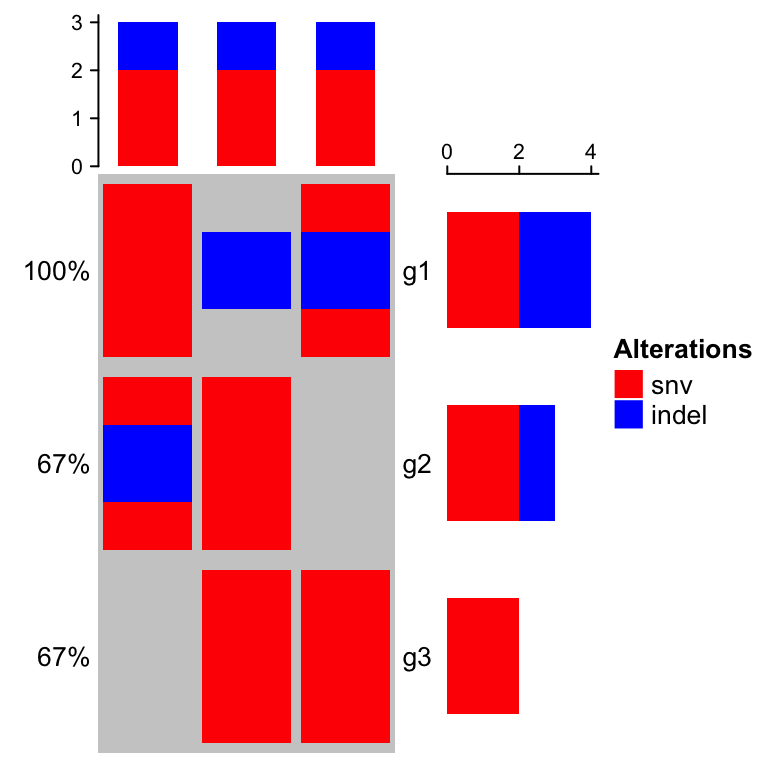
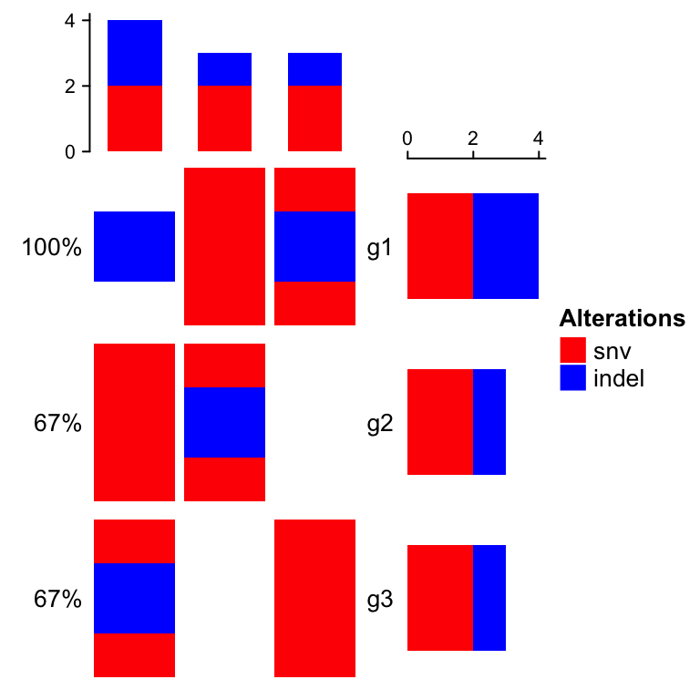
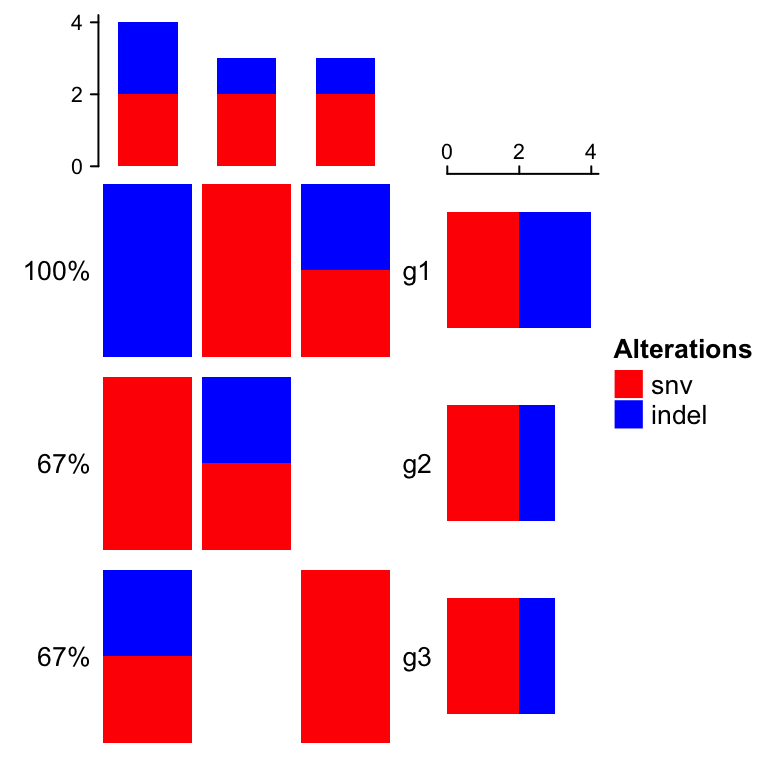
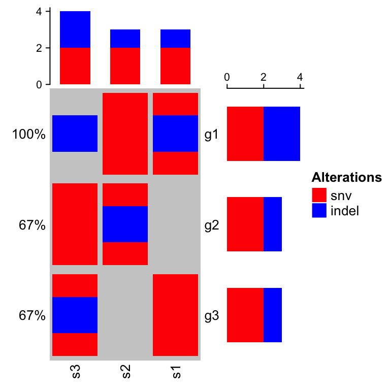
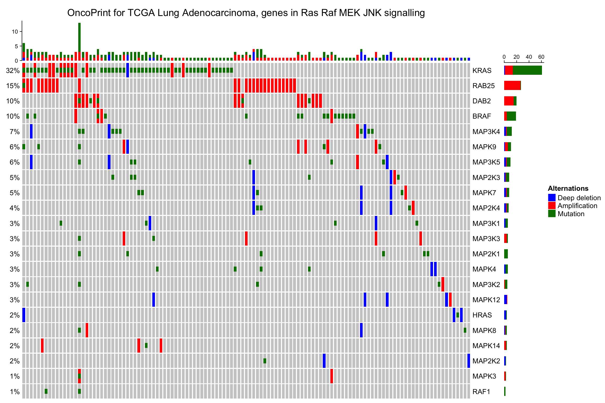
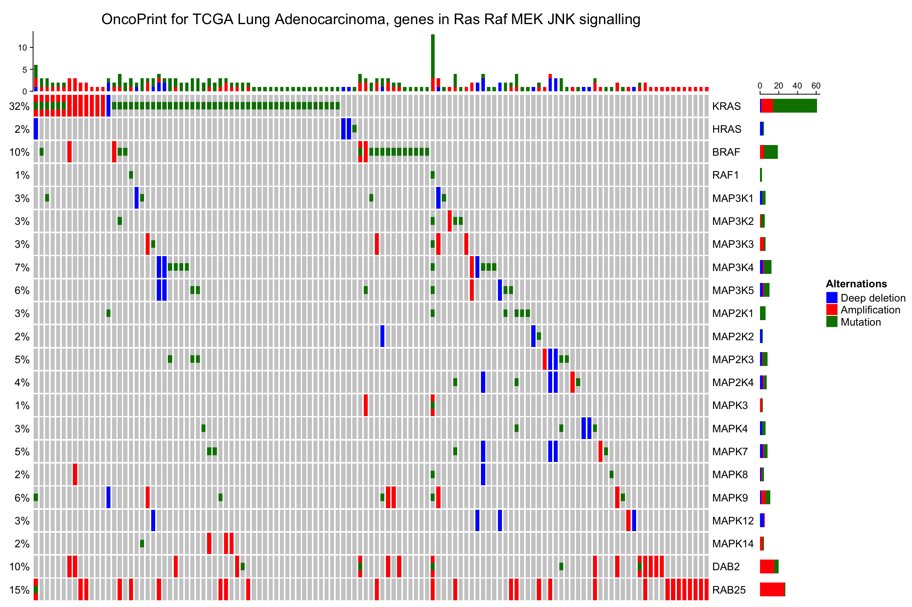
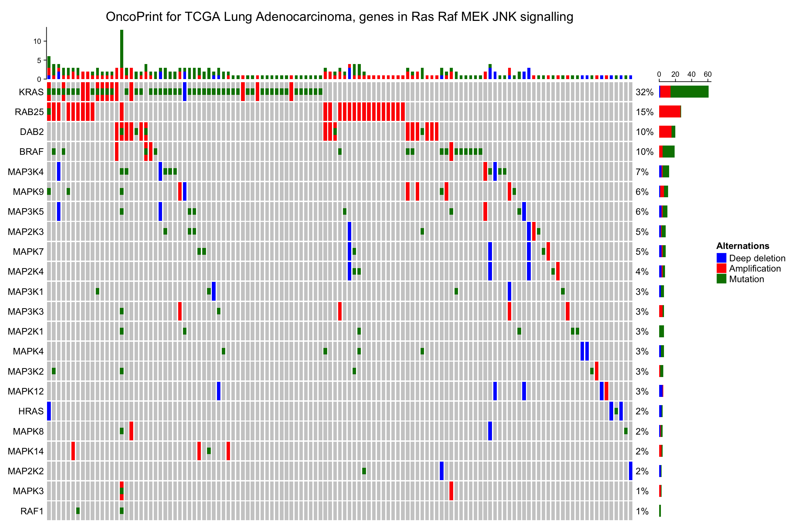
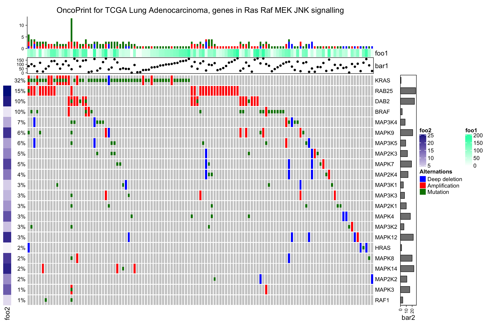

# OncoPrint {#oncoprint}

<a href="http://www.cbioportal.org/faq.jsp#what-are-oncoprints">OncoPrint</a> is a way to visualize
multiple genomic alteration events by heatmap. Here the **ComplexHeatmap** package provides a
`oncoPrint()` function. Besides the default style which is provided by <a href="http://www.cbioportal.org/index.do">cBioPortal</a>, there are additional barplots at both
sides of the heatmap which show numbers of different alterations for each sample and for each gene.
Also with the functionality of **ComplexHeatmap**, you can control oncoPrint with more
flexibilities.

## General settings {#oncoprint-general-settings}


### Input data format {#input-data-format}

There are two different forms of input data. The first is represented as a matrix in which 
each value can include multiple alterations in a form of a complicated string. In follow example,
'g1' in 's1' has two types of alterations which are 'snv' and 'indel'.


```r
mat = read.table(textConnection(
"s1,s2,s3
g1,snv;indel,snv,indel
g2,,snv;indel,snv
g3,snv,,indel;snv"), row.names = 1, header = TRUE, sep = ",", stringsAsFactors = FALSE)
mat = as.matrix(mat)
mat
```

```
##    s1          s2          s3         
## g1 "snv;indel" "snv"       "indel"    
## g2 ""          "snv;indel" "snv"      
## g3 "snv"       ""          "indel;snv"
```

In this case, we need to define a function to extract different alteration types from these long strings. 
The definition of the function is always simple, it accepts the complicated string and returns a vector
of alteration types.

For `mat`, we can define the function as:


```r
get_type_fun = function(x) strsplit(x, ";")[[1]]
get_type_fun(mat[1, 1])
```

```
## [1] "snv"   "indel"
```

```r
get_type_fun(mat[1, 2])
```

```
## [1] "snv"
```

If the alterations are encoded as `snv|indel`, you can define the function as `function(x) strsplit(x, "|")[[1]]`.

This self-defined function is assigned to the `get_type` argument in `oncoPrint()`.

For one gene in one sample, since different alteration types may be drawn into one same grid in the
heatmap, we need to define how to add the graphics by providing a list of self-defined functions to
`alter_fun` argument. Here if the graphics have no transparency, orders of how to add graphics
matters. In following example, snv are first drawn and then the indel. You can see rectangles for
indels are actually smaller than that for snvs so that you can visualiza both snvs and indels if
they are in a same grid. Names in the list of functions should correspond to the alteration types
(here, `snv` and `indel`).

For the self-defined graphic function, there should be four arguments which are positions of the
grids on the heatmap (`x` and `y`), and widths and heights of the grids (`w` and `h`, which is
measured in `npc` unit).

Colors for different alterations are defined in `col`. It should be a named vector for which names
correspond to alteration types. It is used to generate the barplots and the legends.


```r
col = c(snv = "red", indel = "blue")
oncoPrint(mat, get_type = get_type_fun,
	alter_fun = list(
		snv = function(x, y, w, h) grid.rect(x, y, w*0.9, h*0.9, 
			gp = gpar(fill = col["snv"], col = NA)),
		indel = function(x, y, w, h) grid.rect(x, y, w*0.9, h*0.4, 
			gp = gpar(fill = col["indel"], col = NA))
	), col = col)
```

```
## All mutation types: snv, indel
```



If you are confused of how to generated the matrix, there is a second way. The second type of input
data is a list of matrix for which each matrix contains binary value representing whether the
alteration is absent or present. The list should have names which correspond to the alteration
types.


```r
mat_list = list(snv = matrix(c(1, 0, 1, 1, 1, 0, 0, 1, 1), nrow = 3),
	            indel = matrix(c(1, 0, 0, 0, 1, 0, 1, 0, 0), nrow = 3))
rownames(mat_list$snv) = rownames(mat_list$indel) = c("g1", "g2", "g3")
colnames(mat_list$snv) = colnames(mat_list$indel) = c("s1", "s2", "s3")
mat_list
```

```
## $snv
##    s1 s2 s3
## g1  1  1  0
## g2  0  1  1
## g3  1  0  1
## 
## $indel
##    s1 s2 s3
## g1  1  0  1
## g2  0  1  0
## g3  0  0  0
```

`oncoPrint()` expects all matrices in `mat_list` having same row names and column names. 

Pass `mat_list` to `oncoPrint()`:


```r
# now you don't need `get_type`
oncoPrint(mat_list,
	alter_fun = list(
		snv = function(x, y, w, h) grid.rect(x, y, w*0.9, h*0.9, 
			gp = gpar(fill = col["snv"], col = NA)),
		indel = function(x, y, w, h) grid.rect(x, y, w*0.9, h*0.4, 
			gp = gpar(fill = col["indel"], col = NA))
	), col = col)
```

```
## All mutation types: snv, indel
```



OK, in following parts of this Chapter, we still use `mat` and `get_type` to specify the input data.

### Define the alter_fun() {#define-the-alter-fun}

`alter_fun` is a list of functons which add graphics layer by layer (i.e. first
draw for `snv`, then for `indel`). Graphics can also be added in a grid-by-grid style by specifying
`alter_fun` as a single function. The difference from the function list is now `alter_fun` should
accept a fifth argument which is a logical vector. This logical vector shows whether different
alterations exist for current gene in current sample.

Let's assume in a grid there is only snv event, then `v` for this grid is:


```
##   snv indel 
##  TRUE FALSE
```


```r
oncoPrint(mat, get_type = get_type_fun,
	alter_fun = function(x, y, w, h, v) {
		if(v["snv"]) grid.rect(x, y, w*0.9, h*0.9, 
			gp = gpar(fill = col["snv"], col = NA))
		if(v["indel"]) grid.rect(x, y, w*0.9, h*0.4, 
			gp = gpar(fill = col["indel"], col = NA))
	}, col = col)
```

```
## All mutation types: snv, indel
```



If `alter_fun` is set as a single function, customization can be more flexible. In following example,
the blue rectangles can have different height in different grid.


```r
oncoPrint(mat, get_type = get_type_fun,
    alter_fun = function(x, y, w, h, v) {
		n = sum(v)
		h = h*0.9
		# use `names(which(v))` to correctly map between `v` and `col`
		if(n) grid.rect(x, y - h*0.5 + 1:n/n*h, w*0.9, 1/n*h, 
			gp = gpar(fill = col[names(which(v))], col = NA), just = "top")
    }, col = col)
```

```
## All mutation types: snv, indel
```



## Background {#oncoprint-background}

If `alter_fun` is specified as a list, the order of the elements controls the order of adding
graphics. There is a special element called `background` which defines how to draw background and it
should be always put as the first element in the `alter_fun` list. In following example, backgrond
color is changed to light green with borders.


```r
oncoPrint(mat, get_type = get_type_fun,
	alter_fun = list(
		background = function(x, y, w, h) grid.rect(x, y, w, h, 
			gp = gpar(fill = "#00FF0020")),
		snv = function(x, y, w, h) grid.rect(x, y, w*0.9, h*0.9, 
			gp = gpar(fill = col["snv"], col = NA)),
		indel = function(x, y, w, h) grid.rect(x, y, w*0.9, h*0.4, 
			gp = gpar(fill = col["indel"], col = NA))
	), col = col)
```

```
## All mutation types: snv, indel
```


Or just remove the background (don't set it to `NULL`):


```r
oncoPrint(mat, get_type = get_type_fun,
	alter_fun = list(
		background = function(...) NULL,
		snv = function(x, y, w, h) grid.rect(x, y, w*0.9, h*0.9, 
			gp = gpar(fill = col["snv"], col = NA)),
		indel = function(x, y, w, h) grid.rect(x, y, w*0.9, h*0.4, 
			gp = gpar(fill = col["indel"], col = NA))
	), col = col)
```

```
## All mutation types: snv, indel
```


## Apply to cBioPortal dataset {#apply-to-cbioportal-dataset}

We use a real-world dataset to demonstrate advanced usage of `oncoPrint()`.
The data is retrieved from [cBioPortal](http://www.cbioportal.org/). 
Steps for getting the data are as follows:

1. go to http://www.cbioportal.org
2. search Cancer Study: "Lung Adenocarcinoma Carcinoma" and select: "Lung Adenocarcinoma Carcinoma (TCGA, Provisinal)"
3. in "Enter Gene Set" field, select: "General: Ras-Raf-MEK-Erk/JNK signaling (26 genes)"
4. submit the form 

In the results page,

5. go to "Download" tab, download text in "Type of Genetic alterations across all cases"

The order of samples can also be downloaded from the results page,

6. go to "OncoPrint" tab, move the mouse above the plot, click "download" icon and click "Sample order"

First we read the data and make some pre-processing.


```r
mat = read.table(system.file("extdata", package = "ComplexHeatmap", 
	"tcga_lung_adenocarcinoma_provisional_ras_raf_mek_jnk_signalling.txt"), 
	header = TRUE,stringsAsFactors=FALSE, sep = "\t")
mat[is.na(mat)] = ""
rownames(mat) = mat[, 1]
mat = mat[, -1]
mat=  mat[, -ncol(mat)]
mat = t(as.matrix(mat))
mat[1:3, 1:3]
```

```
##      TCGA-05-4384-01 TCGA-05-4390-01 TCGA-05-4425-01
## KRAS "  "            "MUT;"          "  "           
## HRAS "  "            "  "            "  "           
## BRAF "  "            "  "            "  "
```

There are three different alterations in `mat`: `HOMDEL`, `AMP` and `MUT`. We first 
define how to add graphics which correspond to different alterations. 


```r
alter_fun = list(
	background = function(x, y, w, h) {
		grid.rect(x, y, w-unit(0.5, "mm"), h-unit(0.5, "mm"), 
			gp = gpar(fill = "#CCCCCC", col = NA))
	},
	HOMDEL = function(x, y, w, h) {
		grid.rect(x, y, w-unit(0.5, "mm"), h-unit(0.5, "mm"), 
			gp = gpar(fill = "blue", col = NA))
	},
	AMP = function(x, y, w, h) {
		grid.rect(x, y, w-unit(0.5, "mm"), h-unit(0.5, "mm"), 
			gp = gpar(fill = "red", col = NA))
	},
	MUT = function(x, y, w, h) {
		grid.rect(x, y, w-unit(0.5, "mm"), h*0.33, 
			gp = gpar(fill = "#008000", col = NA))
	}
)
```

Also colors for different alterations which will be used for barplots.


```r
col = c("MUT" = "#008000", "AMP" = "red", "HOMDEL" = "blue")
```

Make the oncoPrint.


```r
oncoPrint(mat, get_type = get_type_fun,
	alter_fun = alter_fun, col = col, 
	column_title = "OncoPrint for TCGA Lung Adenocarcinoma, genes in Ras Raf MEK JNK signalling",
	heatmap_legend_param = list(title = "Alternations", at = c("AMP", "HOMDEL", "MUT"), 
		labels = c("Amplification", "Deep deletion", "Mutation")))
```

```
## All mutation types: MUT, AMP, HOMDEL
```



As you see, the genes and samples are sorted automatically. Rows are sorted based on the frequency
of the alterations in all samples and columns are sorted to visualize the mutual exclusivity across
genes based on the "memo sort" method which is kindly provided by [B. Arman
Aksoy](https://gist.github.com/armish/564a65ab874a770e2c26).

### Remove empty rows and columns {#remove-empty-rows-and-columns}

By default, if samples or genes have no alterations, they will still remain in the heatmap, but you can set
`remove_empty_columns` and `remove_empty_rows` to `TRUE` to remove them:


```r
oncoPrint(mat, get_type = get_type_fun,
	alter_fun = alter_fun, col = col, 
	remove_empty_columns = TRUE, remove_empty_rows = TRUE,
	column_title = "OncoPrint for TCGA Lung Adenocarcinoma, genes in Ras Raf MEK JNK signalling",
	heatmap_legend_param = list(title = "Alternations", at = c("AMP", "HOMDEL", "MUT"), 
		labels = c("Amplification", "Deep deletion", "Mutation")))
```

```
## All mutation types: MUT, AMP, HOMDEL
```



### Order of the oncoPrint {#order-of-the-oncoprint}

As the normal `Heatmap()` function, `row_order` or `column_order` can be assigned with a vector of
orders (either numeric or character). In following example, the order of samples are gathered from
cBio as well. You can see the difference for the sample order between 'memo sort' and the method
used by cBio.


```r
sample_order = scan(paste0(system.file("extdata", package = "ComplexHeatmap"), 
    "/sample_order.txt"), what = "character")
oncoPrint(mat, get_type = get_type_fun,
	alter_fun = alter_fun, col = col, 
	row_order = 1:nrow(mat), column_order = sample_order,
	remove_empty_columns = TRUE, remove_empty_rows = TRUE,
	column_title = "OncoPrint for TCGA Lung Adenocarcinoma, genes in Ras Raf MEK JNK signalling",
	heatmap_legend_param = list(title = "Alternations", at = c("AMP", "HOMDEL", "MUT"), 
		labels = c("Amplification", "Deep deletion", "Mutation")))
```

```
## All mutation types: MUT, AMP, HOMDEL
```



### Barplots annotations

On top and right of the oncoPrint, there are barplots showing the number of different alterations for
each gene or for each sample. They are implemented by `anno_oncoprint_barplot()` where you can set the 
size of the annotation there. Also you can select subset of alteration put on barplots by :


```r
oncoPrint(mat, get_type = get_type_fun,
	alter_fun = alter_fun, col = col, 
	top_annotation = HeatmapAnnotation(column_barplot = anno_oncoprint_barplot("MUT")),
	right_annotation = rowAnnotation(row_barplot = anno_oncoprint_barplot(c("AMP", "HOMDEL"),
			axis_param = list(side = "top", labels_rot = 0))),
	remove_empty_columns = TRUE, remove_empty_rows = TRUE,
	column_title = "OncoPrint for TCGA Lung Adenocarcinoma, genes in Ras Raf MEK JNK signalling",
	heatmap_legend_param = list(title = "Alternations", at = c("AMP", "HOMDEL", "MUT"), 
		labels = c("Amplification", "Deep deletion", "Mutation")))
```

```
## All mutation types: MUT, AMP, HOMDEL
```


### oncoPrint as a Heatmap {#oncoprint-as-a-heatmap}

`oncoPrint()` actually returns a `Heatmap` object, so you can add more Heatmaps or annotations horizontally
or vertically to visualize more complicated information.

Following example splits the heatmap into two halves and add a new heatmap to the right.


```r
ht_list = oncoPrint(mat, get_type = function(x) strsplit(x, ";")[[1]],
	alter_fun = alter_fun, col = col, 
	column_title = "OncoPrint for TCGA Lung Adenocarcinoma, genes in Ras Raf MEK JNK signalling",
	heatmap_legend_param = list(title = "Alternations", at = c("AMP", "HOMDEL", "MUT"), 
		labels = c("Amplification", "Deep deletion", "Mutation"))) +
Heatmap(matrix(rnorm(nrow(mat)*10), ncol = 10), name = "expr", width = unit(4, "cm"))
```

```
## All mutation types: MUT, AMP, HOMDEL
```

```r
draw(ht_list)
```



or add it vertically


```r
ht_list = oncoPrint(mat, get_type = function(x) strsplit(x, ";")[[1]],
	alter_fun = alter_fun, col = col, 
	column_title = "OncoPrint for TCGA Lung Adenocarcinoma, genes in Ras Raf MEK JNK signalling",
	heatmap_legend_param = list(title = "Alternations", at = c("AMP", "HOMDEL", "MUT"), 
		labels = c("Amplification", "Deep deletion", "Mutation"))) %v%
Heatmap(matrix(rnorm(ncol(mat)*10), nrow = 10), name = "expr", height = unit(4, "cm"))
```

```
## All mutation types: MUT, AMP, HOMDEL
```

```r
draw(ht_list)
```



You can also split the heatmap list:


```r
ht_list = oncoPrint(mat, get_type = function(x) strsplit(x, ";")[[1]],
	alter_fun = alter_fun, col = col, 
	column_title = "OncoPrint for TCGA Lung Adenocarcinoma, genes in Ras Raf MEK JNK signalling",
	heatmap_legend_param = list(title = "Alternations", at = c("AMP", "HOMDEL", "MUT"), 
		labels = c("Amplification", "Deep deletion", "Mutation"))) +
Heatmap(matrix(rnorm(nrow(mat)*10), ncol = 10), name = "expr", width = unit(4, "cm"))
```

```
## All mutation types: MUT, AMP, HOMDEL
```

```r
draw(ht_list, row_split = sample(c("a", "b"), nrow(mat), replace = TRUE))
```


When `remove_empty_columns` or `remove_empty_rows` is set to TRUE, the number of genes or the samples
are not the original number. If the original matrix has row names and column names...


```r
ht = oncoPrint(mat, get_type = function(x) strsplit(x, ";")[[1]],
	alter_fun = alter_fun, col = col, 
	remove_empty_columns = TRUE, remove_empty_rows = TRUE,
	column_title = "OncoPrint for TCGA Lung Adenocarcinoma, genes in Ras Raf MEK JNK signalling",
	heatmap_legend_param = list(title = "Alternations", at = c("AMP", "HOMDEL", "MUT"), 
		labels = c("Amplification", "Deep deletion", "Mutation")))
```

```
## All mutation types: MUT, AMP, HOMDEL
```

```r
dim(ht)
```

```
## [1]  22 121
```

```r
rownames(ht@matrix)
```

```
##  [1] "KRAS"   "HRAS"   "BRAF"   "RAF1"   "MAP3K1" "MAP3K2" "MAP3K3"
##  [8] "MAP3K4" "MAP3K5" "MAP2K1" "MAP2K2" "MAP2K3" "MAP2K4" "MAPK3" 
## [15] "MAPK4"  "MAPK7"  "MAPK8"  "MAPK9"  "MAPK12" "MAPK14" "DAB2"  
## [22] "RAB25"
```

```r
colnames(ht@matrix)
```

```
##   [1] "TCGA-05-4390-01" "TCGA-38-4631-01" "TCGA-44-6144-01"
##   [4] "TCGA-44-6145-01" "TCGA-44-6146-01" "TCGA-49-4488-01"
##   [7] "TCGA-50-5930-01" "TCGA-50-5931-01" "TCGA-50-5932-01"
##  [10] "TCGA-50-5933-01" "TCGA-50-5941-01" "TCGA-50-5942-01"
##  [13] "TCGA-50-5944-01" "TCGA-50-5946-01" "TCGA-50-6591-01"
##  [16] "TCGA-50-6592-01" "TCGA-50-6594-01" "TCGA-67-4679-01"
##  [19] "TCGA-67-6215-01" "TCGA-73-4658-01" "TCGA-73-4676-01"
##  [22] "TCGA-75-5122-01" "TCGA-75-5125-01" "TCGA-75-5126-01"
##  [25] "TCGA-75-6206-01" "TCGA-75-6211-01" "TCGA-86-6562-01"
##  [28] "TCGA-05-4396-01" "TCGA-05-4405-01" "TCGA-05-4410-01"
##  [31] "TCGA-05-4415-01" "TCGA-05-4417-01" "TCGA-05-4424-01"
##  [34] "TCGA-05-4427-01" "TCGA-05-4433-01" "TCGA-44-6774-01"
##  [37] "TCGA-44-6775-01" "TCGA-44-6776-01" "TCGA-44-6777-01"
##  [40] "TCGA-44-6778-01" "TCGA-49-4487-01" "TCGA-49-4490-01"
##  [43] "TCGA-49-6744-01" "TCGA-49-6745-01" "TCGA-49-6767-01"
##  [46] "TCGA-50-5044-01" "TCGA-50-5051-01" "TCGA-50-5072-01"
##  [49] "TCGA-50-6590-01" "TCGA-55-6642-01" "TCGA-55-6712-01"
##  [52] "TCGA-71-6725-01" "TCGA-91-6828-01" "TCGA-91-6829-01"
##  [55] "TCGA-91-6835-01" "TCGA-91-6836-01" "TCGA-35-3615-01"
##  [58] "TCGA-44-2655-01" "TCGA-44-2656-01" "TCGA-44-2662-01"
##  [61] "TCGA-44-2666-01" "TCGA-44-2668-01" "TCGA-55-1592-01"
##  [64] "TCGA-55-1594-01" "TCGA-55-1595-01" "TCGA-64-1676-01"
##  [67] "TCGA-64-1677-01" "TCGA-64-1678-01" "TCGA-64-1680-01"
##  [70] "TCGA-67-3771-01" "TCGA-67-3773-01" "TCGA-67-3774-01"
##  [73] "TCGA-05-4244-01" "TCGA-05-4249-01" "TCGA-05-4250-01"
##  [76] "TCGA-35-4122-01" "TCGA-35-4123-01" "TCGA-44-2657-01"
##  [79] "TCGA-44-3398-01" "TCGA-44-3918-01" "TCGA-05-4382-01"
##  [82] "TCGA-05-4389-01" "TCGA-05-4395-01" "TCGA-05-4397-01"
##  [85] "TCGA-05-4398-01" "TCGA-05-4402-01" "TCGA-05-4403-01"
##  [88] "TCGA-05-4418-01" "TCGA-05-4420-01" "TCGA-05-4422-01"
##  [91] "TCGA-05-4426-01" "TCGA-05-4430-01" "TCGA-05-4434-01"
##  [94] "TCGA-38-4625-01" "TCGA-38-4626-01" "TCGA-38-4628-01"
##  [97] "TCGA-38-4630-01" "TCGA-44-3396-01" "TCGA-49-4486-01"
## [100] "TCGA-49-4505-01" "TCGA-49-4506-01" "TCGA-49-4507-01"
## [103] "TCGA-49-4510-01" "TCGA-73-4659-01" "TCGA-73-4662-01"
## [106] "TCGA-73-4668-01" "TCGA-73-4670-01" "TCGA-73-4677-01"
## [109] "TCGA-05-5428-01" "TCGA-05-5715-01" "TCGA-50-5045-01"
## [112] "TCGA-50-5049-01" "TCGA-50-5936-01" "TCGA-55-5899-01"
## [115] "TCGA-64-5774-01" "TCGA-64-5775-01" "TCGA-64-5778-01"
## [118] "TCGA-64-5815-01" "TCGA-75-5146-01" "TCGA-75-5147-01"
## [121] "TCGA-80-5611-01"
```
