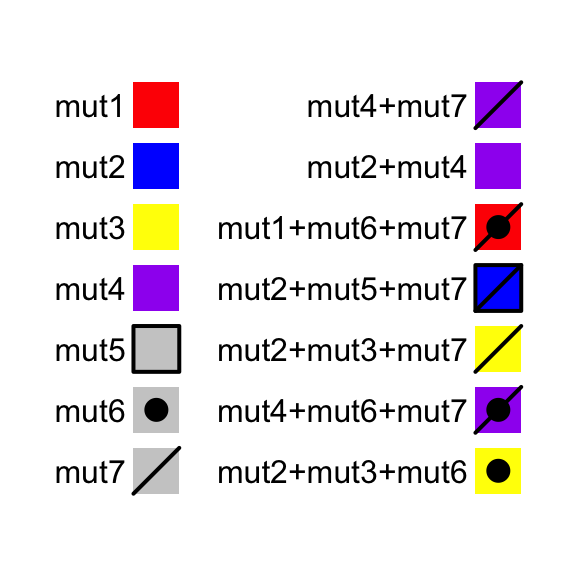

# OncoPrint

<a href="http://www.cbioportal.org/faq.jsp#what-are-oncoprints">OncoPrint</a> is a way to visualize 
multiple genomic alteration events by heatmap. Here the **ComplexHeatmap** package provides a `oncoPrint()` function.
Besides the default style which is provided by <a href="http://www.cbioportal.org/index.do">cBioPortal</a>, there are
additional barplots at both sides of the heatmap which show numbers of different alterations for
each sample and for each gene. Also with the functionality of **ComplexHeatmap**, you can control oncoPrint with
more flexibilities.

## General settings

There are two different forms of input data. The first is represented as a matrix in which 
element would include multiple alterations in a form of a complex string. In follow example,
'g1' in 's1' has two types of alterations which are 'snv' and 'indel'.


```r
mat = read.table(textConnection(
",s1,s2,s3
g1,snv;indel,snv,indel
g2,,snv;indel,snv
g3,snv,,indel;snv"), row.names = 1, header = TRUE, sep = ",", stringsAsFactors = FALSE)
mat = as.matrix(mat)
mat
```

```
##    s1          s2          s3         
## g1 "snv;indel" "snv"       "indel"    
## g2 ""          "snv;indel" "snv"      
## g3 "snv"       ""          "indel;snv"
```

In this case, we need to define a function to extract different alteration types and pass the function
to `get_type` argument. The function should return a vector of alteration types.

For one gene in one sample, since different alteration types may be drawn into one same grid in the heatmap, 
we need to define how to add the graphics by self-defined functions.
Here if the graphics have no transparency, orders of how to add
graphics matters. In following example, snv are first drawn and then the indel. You can see rectangles
for indels are actually smaller than that for snvs so that you can visualiza both snvs and indels if they
are in a same grid. Names in the list of functions should correspond to the alteration types (here, `snv` and `indel`).

For the self-defined graphic function, there should be four arguments which are positions of the grids 
on the heatmap (`x` and `y`), and widths and heights of the grids (`w` and `h`).

Colors for different alterations are defined in `col`. It should be a named vector for which names correspond
to alteration types. It is used to generate the barplots and the legends.


```r
library(ComplexHeatmap)
col = c(snv = "red", indel = "blue")
oncoPrint(mat, get_type = function(x) strsplit(x, ";")[[1]],
	alter_fun = list(
		snv = function(x, y, w, h) grid.rect(x, y, w*0.9, h*0.9, gp = gpar(fill = col["snv"], col = NA)),
		indel = function(x, y, w, h) grid.rect(x, y, w*0.9, h*0.4, gp = gpar(fill = col["indel"], col = NA))
	), col = col)
```

```
## All mutation types: snv, indel
```


In above example, form of the string (e.g. `snv;indel`) correlates to how you define `get_type`. If the string
has the form of `snv|indel|amp`, `get_type` should be defined as `function(x) strsplit(x, "|")[[1]]`.

If you are pulzzed by how to generated the matrix, there is a second way. The second type of input data is a list of matrix for which each matrix contains binary value representing
whether the alteration is absent or present. The list should have names which correspond to the alteration
types.


```r
mat_list = list(snv = matrix(c(1, 0, 1, 1, 1, 0, 0, 1, 1), nrow = 3),
	            indel = matrix(c(1, 0, 0, 0, 1, 0, 1, 0, 0), nrow = 3))
rownames(mat_list$snv) = rownames(mat_list$indel) = c("g1", "g2", "g3")
colnames(mat_list$snv) = colnames(mat_list$indel) = c("s1", "s2", "s3")
mat_list
```

```
## $snv
##    s1 s2 s3
## g1  1  1  0
## g2  0  1  1
## g3  1  0  1
## 
## $indel
##    s1 s2 s3
## g1  1  0  1
## g2  0  1  0
## g3  0  0  0
```

`oncoPrint()` expects all matrix in `mat_list` having same row names and column names. Users can use `unify_mat_list()`
to adjust the matrix list.


```r
mat_list2 = mat_list
mat_list2$indel = mat_list2$indel[1:2, 1:2]
mat_list2
```

```
## $snv
##    s1 s2 s3
## g1  1  1  0
## g2  0  1  1
## g3  1  0  1
## 
## $indel
##    s1 s2
## g1  1  0
## g2  0  1
```

```r
mat_list2 = unify_mat_list(mat_list2)
mat_list2
```

```
## $snv
##    s1 s2 s3
## g1  1  1  0
## g2  0  1  1
## g3  1  0  1
## 
## $indel
##    s1 s2 s3
## g1  1  0  0
## g2  0  1  0
## g3  0  0  0
```

Pass `mat_list` to `oncoPrint()`:


```r
oncoPrint(mat_list,
	alter_fun = list(
		snv = function(x, y, w, h) grid.rect(x, y, w*0.9, h*0.9, gp = gpar(fill = col["snv"], col = NA)),
		indel = function(x, y, w, h) grid.rect(x, y, w*0.9, h*0.4, gp = gpar(fill = col["indel"], col = NA))
	), col = col)
```

```
## All mutation types: snv, indel
```


In above examples, `alter_fun` is a list of functons which add graphics layer by layer. Graphics
can also be added in a grid-by-grid style by specifying `alter_fun` as a single function. The difference
from the function list is now `alter_fun` should accept a fifth argument which is a logical vector. 
This logical vector shows whether different alterations exist for current gene in current sample.

Let's assume in a grid there is only snv event, `v` for this grid is:


```
##   snv indel 
##  TRUE FALSE
```


```r
oncoPrint(mat_list,
	alter_fun = function(x, y, w, h, v) {
		if(v["snv"]) grid.rect(x, y, w*0.9, h*0.9, gp = gpar(fill = col["snv"], col = NA))
		if(v["indel"]) grid.rect(x, y, w*0.9, h*0.4, gp = gpar(fill = col["indel"], col = NA))
	}, col = col)
```

```
## All mutation types: snv, indel
```


If `alter_fun` is set as a single function, customization can be more flexible. In following example,
rectangles always fill the whole grid evenly.


```r
oncoPrint(mat_list,
    alter_fun = function(x, y, w, h, v) {
		n = sum(v)
		h = h*0.9
		# use `names(which(v))` to correctly map between `v` and `col`
		if(n) grid.rect(x, y - h*0.5 + 1:n/n*h, w*0.9, 1/n*h, 
			gp = gpar(fill = col[names(which(v))], col = NA), just = "top")
    }, col = col)
```

```
## All mutation types: snv, indel
```


With a single function for `alter_fun`, you can define different graphics for different alterations.
In following plot, you need to adjust the height of the whole plot to make sure the height for each cell
is more than double of the width.


```r
snv_fun = function(x, y, w, h) {
	grid.rect(x, y, w, h, gp = gpar(fill = col["snv"], col = NA))
}

indel_fun = function(x, y, r) {
	grid.circle(x, y, r, gp = gpar(fill = col["indel"], col = NA))
}

oncoPrint(mat, get_type = function(x) strsplit(x, ";")[[1]],
    alter_fun = function(x, y, w, h, v) {
        n = sum(v)
        w = convertWidth(w, "cm")*0.9
        h = convertHeight(h, "cm")*0.9
        l = min(unit.c(w, h))

        grid.rect(x, y, w, h, gp = gpar(fill = "grey", col = NA))

        if(n == 0) return(NULL)
        if(n == 1) {
        	if(names(which(v)) == "snv") snv_fun(x, y, l, l)
        	if(names(which(v)) == "indel") indel_fun(x, y, l*0.5)
        } else if(n == 2) {
        	snv_fun(x, y-0.25*h, l, l)
        	indel_fun(x, y+0.25*h, l*0.5)
        }
    }, col = col)
```

```
## All mutation types: snv, indel
```


If `alter_fun` is specified as a list, the order of the elements controls the order of adding graphics. 
There is a special element named `background` which defines how to draw background and it should be always put
as the first element in the `alter_fun` list. In following example, backgrond color is changed to light green with borders.


```r
oncoPrint(mat_list,
	alter_fun = list(
		background = function(x, y, w, h) grid.rect(x, y, w, h, gp = gpar(fill = "#00FF0020")),
		snv = function(x, y, w, h) grid.rect(x, y, w*0.9, h*0.9, gp = gpar(fill = col["snv"], col = NA)),
		indel = function(x, y, w, h) grid.rect(x, y, w*0.9, h*0.4, gp = gpar(fill = col["indel"], col = NA))
	), col = col)
```

```
## All mutation types: snv, indel
```



Or just remove the background:


```r
oncoPrint(mat_list,
	alter_fun = list(
		background = NULL,
		snv = function(x, y, w, h) grid.rect(x, y, w*0.9, h*0.9, gp = gpar(fill = col["snv"], col = NA)),
		indel = function(x, y, w, h) grid.rect(x, y, w*0.9, h*0.4, gp = gpar(fill = col["indel"], col = NA))
	), col = col)
```

```
## All mutation types: snv, indel
```


You can customize the oncoprot by self-defining `alter_fun`. But be careful you must
convert `w` and `h` to absolute units.


```r
oncoPrint(mat, get_type = function(x) strsplit(x, ";")[[1]],
    alter_fun = list(
        snv = function(x, y, w, h) {
        	w = convertWidth(w, "cm")
        	h = convertHeight(h, "cm")
        	l = min(unit.c(w, h))
        	grid.rect(x, y, l*0.9, l*0.9, gp = gpar(fill = col["snv"], col = NA))
        },
        indel = function(x, y, w, h) {
        	w = convertWidth(w, "cm")
        	h = convertHeight(h, "cm")
        	r = min(unit.c(w, h))*0.5
        	grid.circle(x, y, r*0.9, gp = gpar(fill = col["indel"], col = NA))
        }
    ), col = col)
```

```
## All mutation types: snv, indel
```


## Apply to cBioPortal dataset

Now we make an oncoPrint with a real-world data. The data is retrieved from [cBioPortal](http://www.cbioportal.org/). 
Steps for getting the data are as follows:

1. go to http://www.cbioportal.org
2. search Cancer Study: "Lung Adenocarcinoma Carcinoma" and select: "Lung Adenocarcinoma Carcinoma (TCGA, Provisinal)"
3. In "Enter Gene Set" field, select: "General: Ras-Raf-MEK-Erk/JNK signaling (26 genes)"
4. submit the form

In the results page,

5. go to "Download" tab, download text in "Type of Genetic alterations across all cases"

The order of samples can also be downloaded from the results page,

6. go to "OncoPrint" tab, move the mouse above the plot, click "download" icon and click "Sample order"

First we read the data and do some pre-processing.


```r
mat = read.table(paste0(system.file("extdata", package = "ComplexHeatmap"), 
	"/tcga_lung_adenocarcinoma_provisional_ras_raf_mek_jnk_signalling.txt"), 
	header = TRUE,stringsAsFactors=FALSE, sep = "\t")
mat[is.na(mat)] = ""
rownames(mat) = mat[, 1]
mat = mat[, -1]
mat=  mat[, -ncol(mat)]
mat = t(as.matrix(mat))
mat[1:3, 1:3]
```

```
##      TCGA-05-4384-01 TCGA-05-4390-01 TCGA-05-4425-01
## KRAS "  "            "MUT;"          "  "           
## HRAS "  "            "  "            "  "           
## BRAF "  "            "  "            "  "
```

There are three different alterations in `mat`: `HOMDEL`, `AMP` and `MUT`. We first 
define how to add graphics which correspond to different alterations. 


```r
alter_fun = list(
	background = function(x, y, w, h) {
		grid.rect(x, y, w-unit(0.5, "mm"), h-unit(0.5, "mm"), gp = gpar(fill = "#CCCCCC", col = NA))
	},
	HOMDEL = function(x, y, w, h) {
		grid.rect(x, y, w-unit(0.5, "mm"), h-unit(0.5, "mm"), gp = gpar(fill = "blue", col = NA))
	},
	AMP = function(x, y, w, h) {
		grid.rect(x, y, w-unit(0.5, "mm"), h-unit(0.5, "mm"), gp = gpar(fill = "red", col = NA))
	},
	MUT = function(x, y, w, h) {
		grid.rect(x, y, w-unit(0.5, "mm"), h*0.33, gp = gpar(fill = "#008000", col = NA))
	}
)
```

Also colors for different alterations which will be used for barplots.


```r
col = c("MUT" = "#008000", "AMP" = "red", "HOMDEL" = "blue")
```

Make the oncoPrint and adjust heatmap components such as the title and the legend.


```r
oncoPrint(mat, get_type = function(x) strsplit(x, ";")[[1]],
	alter_fun = alter_fun, col = col, 
	column_title = "OncoPrint for TCGA Lung Adenocarcinoma, genes in Ras Raf MEK JNK signalling",
	heatmap_legend_param = list(title = "Alternations", at = c("AMP", "HOMDEL", "MUT"), 
		labels = c("Amplification", "Deep deletion", "Mutation")))
```

```
## All mutation types: MUT, AMP, HOMDEL
```


As you see, the genes and samples are sorted automatically. Rows are sorted based on the frequency
of the alterations in all samples and columns are sorted to visualize the mutual exclusivity across genes
based on the "memo sort" method which is
kindly provided by [B. Arman Aksoy](https://gist.github.com/armish/564a65ab874a770e2c26). If you want
to turn off the default sorting, set `row_order` or `column_order` to `NULL`.


By default, if one sample has no alteration, it will still remain in the heatmap, but you can set
`remove_empty_columns` to `TRUE` to remove it:


```r
oncoPrint(mat, get_type = function(x) strsplit(x, ";")[[1]],
	alter_fun = alter_fun, col = col, 
	remove_empty_columns = TRUE,
	column_title = "OncoPrint for TCGA Lung Adenocarcinoma, genes in Ras Raf MEK JNK signalling",
	heatmap_legend_param = list(title = "Alternations", at = c("AMP", "HOMDEL", "MUT"), 
		labels = c("Amplification", "Deep deletion", "Mutation")))
```

```
## All mutation types: MUT, AMP, HOMDEL
```


As the normal `Heatmap()` function, `row_order` or `column_order` can be assigned with a vector of 
orders (either numeric or character). Following the order of samples are gathered from cBio as well.
You can see the difference for the sample order between 'memo sort' and the method used by cBio.

Also notice how we move the legend to the bottom of the oncoPrint.


```r
sample_order = scan(paste0(system.file("extdata", package = "ComplexHeatmap"), 
    "/sample_order.txt"), what = "character")
ht = oncoPrint(mat, get_type = function(x) strsplit(x, ";")[[1]],
	alter_fun = alter_fun, col = col, 
	row_order = NULL, column_order = sample_order,
	remove_empty_columns = TRUE,
	column_title = "OncoPrint for TCGA Lung Adenocarcinoma, genes in Ras Raf MEK JNK signalling",
	heatmap_legend_param = list(title = "Alternations", at = c("AMP", "HOMDEL", "MUT"), 
		labels = c("Amplification", "Deep deletion", "Mutation"),
		nrow = 1, title_position = "leftcenter"))
```

```
## All mutation types: MUT, AMP, HOMDEL
```

```r
draw(ht, heatmap_legend_side = "bottom")
```


`oncoPrint()` actually returns a `HeatmapList` object, so you can add more Heatmaps or row annotations
to it to visualize more complicated information.

Following example splits the heatmap into two halves and add a new heatmap to the right.


```r
ht_list = oncoPrint(mat, get_type = function(x) strsplit(x, ";")[[1]],
	alter_fun = alter_fun, col = col, 
	remove_empty_columns = TRUE,
	column_title = "OncoPrint for TCGA Lung Adenocarcinoma, genes in Ras Raf MEK JNK signalling",
	heatmap_legend_param = list(title = "Alternations", at = c("AMP", "HOMDEL", "MUT"), 
		labels = c("Amplification", "Deep deletion", "Mutation")),
	split = sample(letters[1:2], nrow(mat), replace = TRUE)) +
Heatmap(matrix(rnorm(nrow(mat)*10), ncol = 10), name = "expr", show_column_dend = FALSE, width = unit(4, "cm"))
```

```
## All mutation types: MUT, AMP, HOMDEL
```

```r
draw(ht_list, row_sub_title_side = "left")
```


If you make the plot in an interactive device (e.g. `X11` or Rstudio IDE), the generation of the plot
may be very slow. In this case, we suggest users to directly save the plot to a separate file 
(e.g. using `png()` or `pdf()`) and then visualize the plot afterwards.


## Session info


```r
sessionInfo()
```

```
## R version 3.4.4 (2018-03-15)
## Platform: x86_64-apple-darwin15.6.0 (64-bit)
## Running under: macOS High Sierra 10.13.2
## 
## Matrix products: default
## BLAS: /Library/Frameworks/R.framework/Versions/3.4/Resources/lib/libRblas.0.dylib
## LAPACK: /Library/Frameworks/R.framework/Versions/3.4/Resources/lib/libRlapack.dylib
## 
## locale:
## [1] en_GB.UTF-8/en_GB.UTF-8/en_GB.UTF-8/C/en_GB.UTF-8/en_GB.UTF-8
## 
## attached base packages:
## [1] grid      methods   stats     graphics  grDevices utils     datasets 
## [8] base     
## 
## other attached packages:
## [1] dendsort_0.3.3        dendextend_1.8.0      circlize_0.4.5       
## [4] ComplexHeatmap_1.99.0
## 
## loaded via a namespace (and not attached):
##  [1] shape_1.4.4         modeltools_0.2-22   GetoptLong_0.1.7   
##  [4] tidyselect_0.2.4    xfun_0.3            kernlab_0.9-27     
##  [7] purrr_0.2.5         lattice_0.20-35     colorspace_1.3-2   
## [10] viridisLite_0.3.0   htmltools_0.3.6     stats4_3.4.4       
## [13] yaml_2.2.0          rlang_0.2.2         pillar_1.3.0       
## [16] glue_1.3.0          prabclus_2.2-6      RColorBrewer_1.1-2 
## [19] fpc_2.1-11.1        bindrcpp_0.2.2      plyr_1.8.4         
## [22] bindr_0.1.1         robustbase_0.93-2   stringr_1.3.1      
## [25] munsell_0.5.0       gtable_0.2.0        mvtnorm_1.0-8      
## [28] GlobalOptions_0.1.1 evaluate_0.11       knitr_1.20         
## [31] flexmix_2.3-14      class_7.3-14        DEoptimR_1.0-8     
## [34] trimcluster_0.1-2.1 Rcpp_0.12.18        scales_1.0.0       
## [37] backports_1.1.2     diptest_0.75-7      gridExtra_2.3      
## [40] rjson_0.2.20        ggplot2_3.0.0       digest_0.6.17      
## [43] stringi_1.2.4       bookdown_0.7        dplyr_0.7.6        
## [46] rprojroot_1.3-2     tools_3.4.4         magrittr_1.5       
## [49] lazyeval_0.2.1      tibble_1.4.2        cluster_2.0.7-1    
## [52] crayon_1.3.4        whisker_0.3-2       pkgconfig_2.0.2    
## [55] MASS_7.3-50         viridis_0.5.1       assertthat_0.2.0   
## [58] rmarkdown_1.10      R6_2.2.2            mclust_5.4.1       
## [61] nnet_7.3-12         compiler_3.4.4
```
