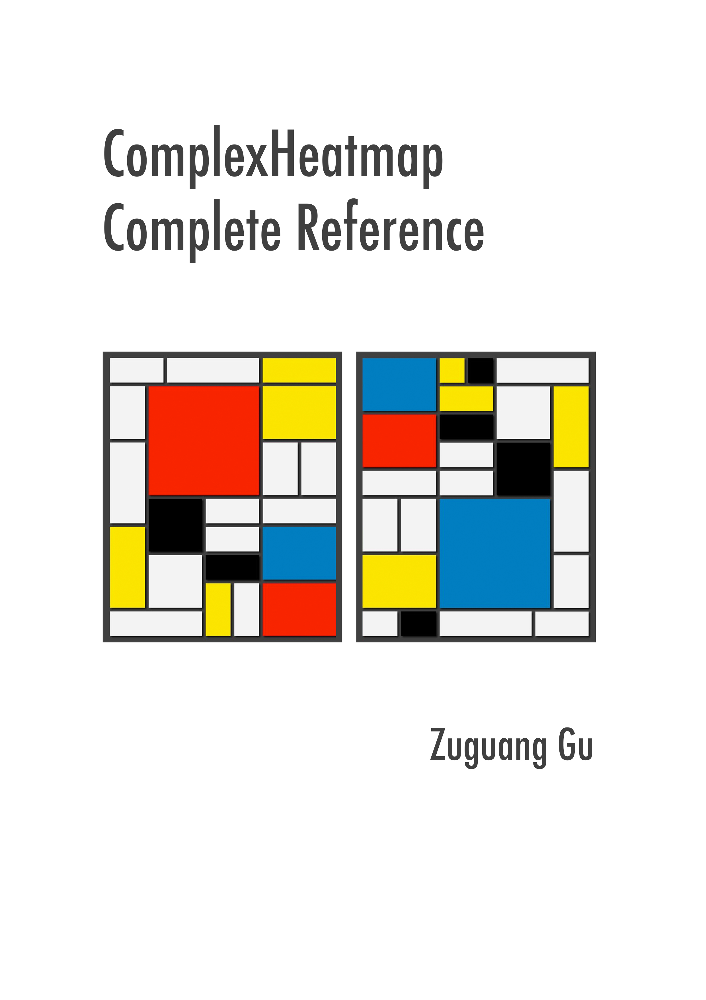

--- 
title: "ComplexHeatmap Complete Reference"
author: "Zuguang Gu"
date: "last revised on 2018-10-13"
site: bookdown::bookdown_site
output: bookdown::gitbook
documentclass: book
bibliography: [book.bib]
biblio-style: apalike
link-citations: yes
github-repo: jokergoo/ComplexHeatmap_book
cover-image: complexheatmap-cover.jpg
url: 'https\://jokergoo.github.io/ComplexHeatmap-book/'
description: "This book is a complete reference to ComplexHeatmap pacakge."
---

# About {-}

This is the documentation of the
[**ComplexHeatmap**](http://bioconductor.org/packages/ComplexHeatmap/) package. Examples
in the book are generated under version 1.99.0.

**Please note, this documentation is not completely compatible with lower
versions (< 2.0.0, before Oct, 2018).**

If you use **ComplexHeatmap** in your publications, I would be appreciated if you can cite:

Gu, Z. (2016) Complex heatmaps reveal patterns and correlations in multidimensional genomic data. DOI:
[10.1093/bioinformatics/btw313](https://doi.org/10.1093/bioinformatics/btw313)

