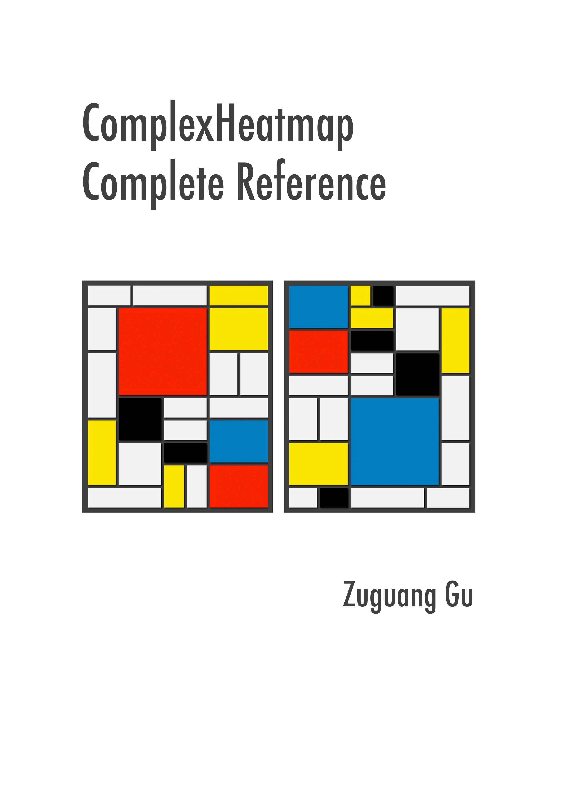

--- 
title: "ComplexHeatmap Complete Reference"
author: "Zuguang Gu"
date: "last revised on `r Sys.Date()`"
site: bookdown::bookdown_site
output: bookdown::gitbook
documentclass: book
bibliography: [book.bib]
biblio-style: apalike
link-citations: yes
github-repo: jokergoo/ComplexHeatmap-reference
cover-image: complexheatmap-cover.jpg
url: 'https\://jokergoo.github.io/ComplexHeatmap-reference/book'
description: "Complex heatmaps are efficient to visualize associations between different sources of data sets and reveal potential patterns. Here the ComplexHeatmap R package provides a highly flexible way to arrange multiple heatmaps and supports various annotation graphics. This book is the complete reference to ComplexHeatmap pacakge."
---

# About {-}

This is the documentation of the
[**ComplexHeatmap**](http://bioconductor.org/packages/ComplexHeatmap/) package. Examples in the book
are generated under version `r installed.packages()["ComplexHeatmap", "Version"]`.

**Please note, this documentation is not completely compatible with older versions (1.*.*, before
Oct, 2018), but the major functionality keeps the same.**

If you use **ComplexHeatmap** in your publications, I am appreciated if you can cite:

Gu, Z. (2016) Complex heatmaps reveal patterns and correlations in multidimensional genomic data.
DOI: [10.1093/bioinformatics/btw313](https://doi.org/10.1093/bioinformatics/btw313)

